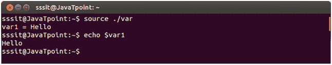
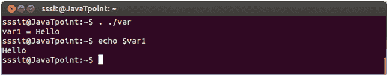

# 获取文件的ShellScript

> 原文：<https://www.javatpoint.com/shell-scripting-sourcing-a-file>

文件有两种来源。一个是写为**来源** < **文件名** >或者另一个是写为。。/ <命令行中的**文件名>** 。当获取文件时，代码行的执行就像它们被打印在命令行上一样。

获取和执行脚本的区别在于，在执行脚本时，它在一个新的 shell 中运行，而在获取脚本时，文件将在同一个 shell 中读取和执行。

在采购中，脚本内容显示在同一个外壳中，但执行脚本时在不同的外壳中运行。

看上面的快照，我们已经用其中一种方法获得了文件 **var** 。

看上面的快照，我们已经用另一种方法获得了文件 **var** 。