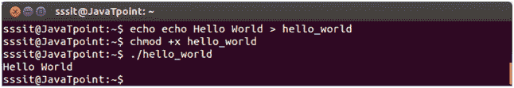

# 编写和执行脚本的步骤

> 原文：<https://www.javatpoint.com/steps-to-write-and-execute-a-shell-script>

*   打开终端。转到要创建脚本的目录。
*   用**创建文件。sh** 分机。
*   使用编辑器在文件中编写脚本。
*   使用命令 **chmod +x** < **文件名** >使脚本可执行。
*   使用运行脚本。/< **文件名** >。

**注意:**在最后一步中，如果你的脚本在其他目录中，你必须提到脚本的路径。

* * *

## 你好世界剧本

这里我们将为你好世界写一个简单的程序。

首先，在任何编辑器中或使用 echo 创建一个简单的脚本。然后我们用 **chmod +x** 命令使其可执行。要找到脚本，您必须键入 shell 的脚本路径。

看上面的快照，脚本 **echo Hello World** 是用 echo 命令作为 **hello_world 创建的。**现在传递命令 **chmod +x hello_world** 使其可执行。我们已经发出命令**。/hello_world** 来提一下 hello_world 路径。并显示输出。