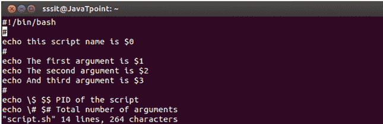
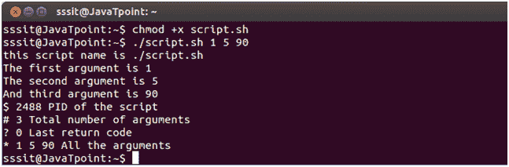

# 外壳脚本参数

> 原文：<https://www.javatpoint.com/shell-script-parameters>

bash shell 脚本有参数。这些参数从 **$1** 到 **$9 开始。**

当我们将参数传递到命令行界面时，会通过 shell 为这些参数分配一个位置参数。

第一个参数被指定为$1，第二个参数被指定为$2，依此类推...

如果有 9 个以上的参数，那么**第十个**或以后的参数不能被指定为$10 或$11。

您必须处理或保存$1 参数，然后借助 **shift** 命令删除参数 1，并将所有其他参数下移一位。它将使 10 美元成为 9 美元，9 美元成为 8 美元，以此类推。

**外壳参数**

| 因素 | 功能 |
| $1-$9 | 表示参数 1 到 9 的位置参数 |
| ${10}-${n} | 表示九后参数的位置参数 |
| $0 | 表示脚本的名称 |
| $ * * | 将所有参数表示为一个字符串 |
| [【邮件保护】](/cdn-cgi/l/email-protection) | 与$∞相同，但用(")括起来时有所不同 |
| $# | 表示参数的总数 |
| $$ | 脚本的 PID |
| $? | 表示最后一个返回代码 |

**示例:**

看上面的快照，这是我们编写的脚本，用来显示不同的参数。

看上面的快照，我们已经传递了参数 **1，5，90** 。当脚本运行时，所有参数都显示它们的值。