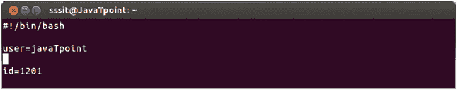
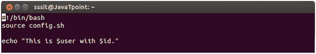
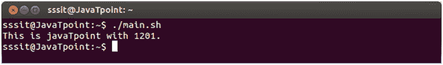

# 外壳脚本获取配置文件

> 原文：<https://www.javatpoint.com/shell-scripting-sourcing-a-config-file>

许多程序使用外部配置文件。使用外部配置文件可以防止用户对脚本进行更改。配置文件是借助**源**命令添加的。

如果一个脚本被许多用户共享，并且每个用户都需要不同的配置文件，那么不要每次都更改脚本，只需包含配置文件即可。

**示例:**

我们有两个文件，一个是父文件 **(main.sh)** ，另一个是配置文件 **(config.sh)** 。我们必须将这个配置文件导入到父文件中。

**配置脚本**

**main . sh 的脚本**

看看上面的快照，我们已经将 config.sh 文件包含在源代码命令中。

**注:**我们也可以用**(。config.sh )** 命令代替**(来源 config.sh )** 。

现在在运行 main.sh 文件时，包含了 config.sh 文件。

看上面的快照，在运行 main.sh 文件时，config.sh 文件的内容是通过 source 命令导入的。