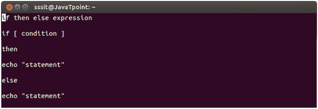
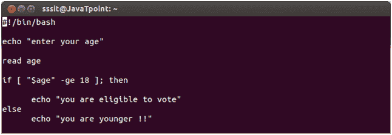
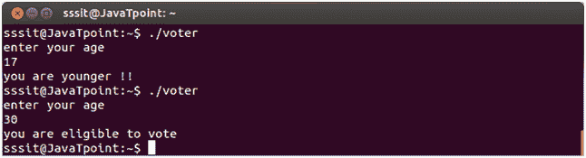

# 外壳脚本，如果没有的话

> 原文：<https://www.javatpoint.com/if-then-else-shell-scripting>

if then else 条件循环表示**如果**条件满足，输出进入 if 部分，否则输出进入 **else** 部分。

单词 **fi** 代表 if 循环终止。

**语法:**

if then else 的语法显示在下面的快照中，



**if then else 示例:**

我们已经展示了投票的例子。如果用户的年龄将大于 18 岁，那么他或她将有资格投票，否则没有资格。

```
if condition:
if [ "$age" -ge 18 ];

```



看上面的快照，我们已经展示了文件投票器的脚本。



看上面的快照，随着年龄 **17** 显示信息**“你更年轻了！!"**随着年龄增长 **30** 显示信息**“你有资格投票”。**