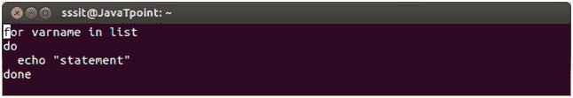
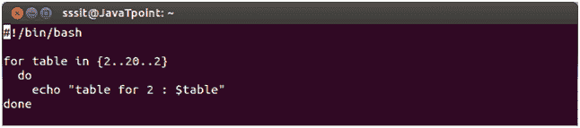
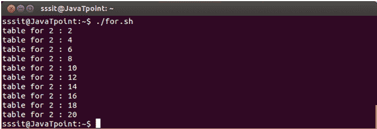
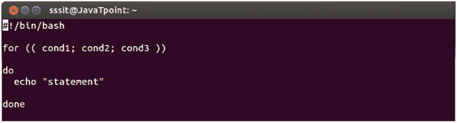
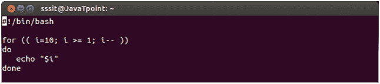
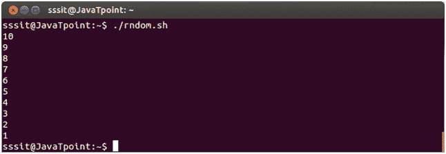

# 循环的外壳脚本

> 原文：<https://www.javatpoint.com/for-loop-shell-scripting>

for 循环遍历指定的值列表，直到该列表用完。

**1)语法:**

使用中的**形成循环的语法和值列表如下所示。这个 for 循环包含列表中的许多变量，并将对列表中的每个项目执行。例如，如果列表中有 10 个变量，那么循环将执行十次，值将存储在 varname 中。**

看看上面的语法:

*   关键词是，在，做，完成
*   列表是由空格分隔的变量列表。如果 for 语句中没有提到 list，那么它将采用传递到 shell 中的位置参数值。
*   Varname 是用户假定的任何变量。

## 例如:

我们已经展示了一个在 for 循环中计算 2 的表的例子。

看上面的快照，我们的 varname 是**表**，列表在花括号下指定。在大括号内，前两个将从 2 开始初始化表，20 代表$table 的最大值，最后两个显示值 2 的增量。

看上面的快照，它显示 2 的表作为输出。

**2)语法:**

类似 C 编程语言的语法。

看上面的快照，条件 1 表示**初始化**，条件 2 表示**条件**，条件 3 表示**上升。**

## 例如:

我们已经展示了一个反向计数的例子。

看上面的快照，这是循环脚本。$i 将从 10 开始初始化，直到 1，从 1 开始递减。

看上面的快照，这是脚本的输出。