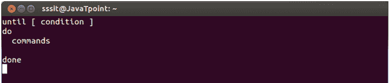
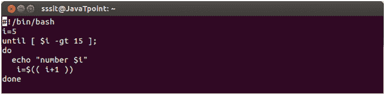
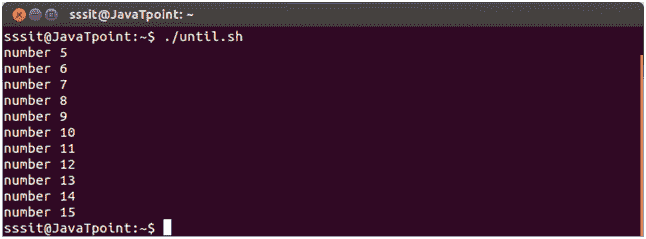

# ShellScript直到循环

> 原文：<https://www.javatpoint.com/until-loop-shell-scripting>

它类似于 while 循环。唯一不同的是**直到**语句执行其代码块**而**其条件表达式为假，而 while 语句执行其代码块而其条件表达式为真。

* * *

## while 和直到之间的差异

直到循环总是至少执行一次。循环执行，直到返回零值，循环执行，直到返回非零值。

**语法:**

直到循环的语法如下图所示:

## 示例:

我们已经展示了一个从 5 到 15 显示数字的例子。

看上面的快照，它显示了脚本。

看上面的快照，它显示输出，直到条件为假。