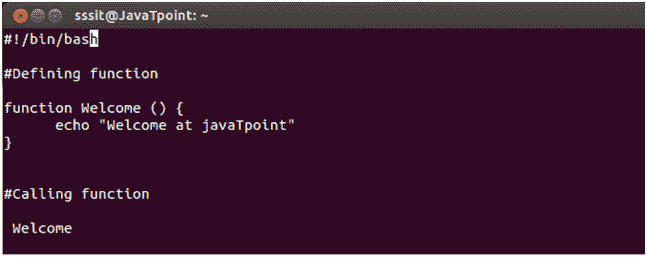
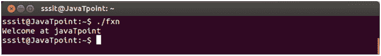
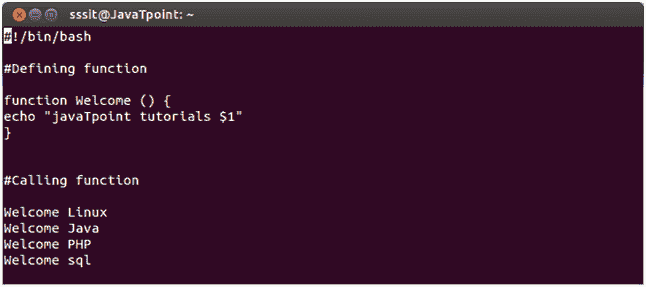
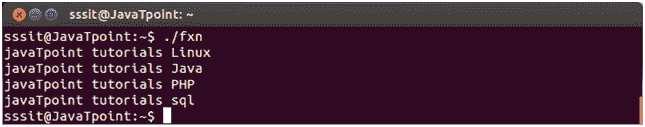

# 外壳函数

> 原文：<https://www.javatpoint.com/scripting-shell-function>

在函数的帮助下，函数的整体功能可以被分成更小的或逻辑的部分，这些部分可以被调用来执行它们的任务。它帮助我们一部分一部分地检查我们的程序。我们可以在任何我们想要的地方重用这个功能。

**创建功能**

**语法:**

```
 function functionName () {
		Commands to be executed
}

```

您将使用它们的函数名调用您的函数。

**示例:**

```
function Welcome () {

}

```



看上面的快照，我们已经创建了一个函数**欢迎使用。**我们在上面的脚本中已经调用过了。



看上面的快照，在执行上面的脚本时，会调用函数 **Welcome** 。

* * *

## 传递参数

您可以在函数中传递一个或多个参数。参数将被定义为$1、$2 等等。



看上面的快照， **$1** 是传递给函数的参数。



看看上面的快照，脚本产生了上面的输出。