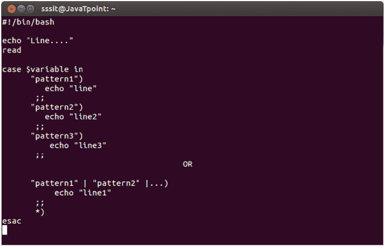
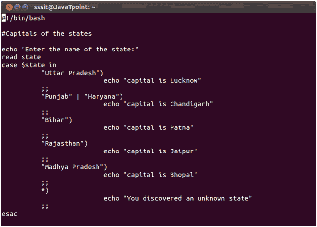
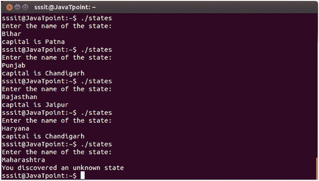

# ShellScript案例

> 原文：<https://www.javatpoint.com/shell-scripting-case>

案例构造帮助我们简化嵌套的 if 语句。您可以将几个变量与一个变量进行匹配。每个案例都是一个符合特定模式的表达式。

**语法:**

看上面的快照，可以根据情况写一个模式，也可以一起写多个模式。让我们看一个例子来更清楚地理解它。

**示例:**

看上面的快照，我们已经展示了一个脚本来展示不同州的首府。旁遮普邦和哈里亚纳邦因为共享相同的首都而被写在一起。

**输出:**

看上面的快照，用户可以输入一个州名，脚本会分别显示它的大写。