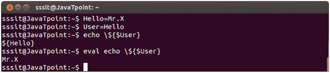
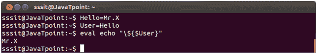
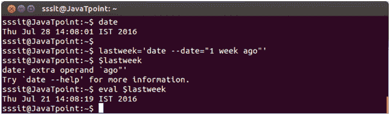
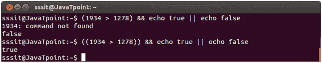

# 外壳脚本评估命令

> 原文：<https://www.javatpoint.com/shell-scripting-eval>

eval 命令是一个内置命令。它将一个字符串作为参数并对其求值，然后运行参数中存储的命令。它允许使用变量值作为变量。

**例 1:**

```
eval echo \${$User}

```



看上面的快照，命令**“echo \ $ { $User }”**运行$ User 作为 shell 变量并显示其输出。

但是命令**“eval echo \ $ { $ User }”**运行传递给 eval 的参数。扩展后剩余参数为**回声**和 **${Hello}** 。因此 eval 命令运行命令**回显${Hello}** 。输出是 X 先生

**变量和命令替换周围必须使用双引号**。如果没有双引号，shell 可能会对变量的不同单词执行字段拆分。



**例 2:**


看上面的快照，我们已经传递了一个参数(1 周前)给**日期**命令。这是显示的最后一周日期和时间。

但是，当我们在变量(上周)中设置该命令并运行它时，该命令无法打印日期。往下看，



看上面的快照，命令**“$ last week”**失败，而命令**“eval $ last week”**成功运行。

* * *

## (( ))

此标志主要用于数值评估。这是一个复合命令。



看上面的快照，单括号 **( )** 给出错误，而双括号**()**成功执行命令。