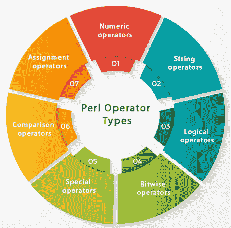

# Perl 运算符类型

> 原文：<https://www.javatpoint.com/perl-operator-types>

Perl 运算符为它们的操作数提供值，如数字、布尔或字符串等。要选择合适的运算符，您需要知道操作数的值。

我们将讨论以下类型的运算符:

*   数字运算符
*   字符串运算符
*   逻辑运算符
*   按位运算符
*   特殊操作员
*   比较运算符
*   赋值运算符



### Perl 数值运算符

数值运算符是标准的算术运算符，如加法(+)、减法(-)、乘法(*)、除法(/)和模(%)等。

### Perl 字符串运算符

字符串运算符是带有重复(=~和！~)和串联(。).

**字符串连接运算符**

```
use 5.010;
use strict;
use warnings;
my $result = "Hello this is " . "JavaTpoint.";
say $result;

```

输出:

```
Hello this is JavaTpoint.

```

**字符串重复运算符**

```
use 5.010;
use strict;
use warnings;
my $result = "Thank You " x 3;
say $result;

```

输出:

```
Thank You Thank You Thank You.

```

这里，请注意，在“x”的右边，它必须是一个整数。

“x”运算符的两边都应该有空格。

例如，

```
$result = "Thank You " x 3;  # This is correct
$result = "Thank You "x3;  # This is incorrect

```

* * *

## 逻辑运算符

逻辑运算符为其操作数赋予布尔值。它们是(&&、||和或)。

**& & - >** 在& &运算符中，如果$a 为 0，则$a 的值& & $b 无论$b 的值如何都必须为假。因此 perl 懒得检查$b 的值。这叫做短路评估。

**|->|-**在||运算符中，如果$a 是非零的，那么不管$b 的值是多少，$a 的值& & $b 必须是真的。因此 perl 懒得检查$b 的值。

**示例:**

```
use 5.010;
use strict;
use warnings;
$a = 0;
$b = 12;
my $result1 = $a && $b; 
say $result1;
$a = 12;
$b = 14;
my $result2 = $a || $b;
say $result2;

```

输出:

```
0
12

```

* * *

## Perl 逐位运算符

按位运算符在位级别对其操作数进行数值处理。这些是(<>、&、|、^、<<=, > >=、&=、|=、^=).

每个数字都用 0 和 1 来表示。最初，整数将被转换成二进制位，结果将被评估。最终结果将以整数形式显示。

**示例:**

```
use 5.010;
use strict;
use warnings;
#OR operator
my $result1 = 124.3 | 99;
say $result1;
#AND operator
my $result2 = 124.3 & 99;
say $result2;
#XOR operator
my $result3 = 124.3 ^ 99;
say $result3;
#Shift operator
my $result4 = 124 >> 3;
say $result4;

```

输出:

```
127
96
31
15

```

* * *

## 特殊运算符

自动递增(++)运算符是一种特殊的运算符，它将数字字符本身递增 1。

**示例:**

```
use 5.010;
use strict;
use warnings;
my $num = 9;
my $str = 'x';
$num++;
$str++;
say $num++;
say $str++;

```

输出:

```
10
Y

```

* * *

## Perl 比较运算符

比较运算符比较其操作数的值。这些是(==，，> =，<=>，！=).

**示例:**

```
use 5.010;
use strict;
use warnings;
say "Enter your salary:";
my $salary = <>;
if($salary >= 20000)
{
	say "You are earning well";
} else {
	say "You are not earning well";
}

```

输出:

```
Enter your salary:
15000
You are not earning well

```

* * *

## Perl 赋值运算符

赋值运算符给变量赋值。

这些是(=，+=，-=，*=，/=，|=，&=，%=)

**示例:**

```
use 5.010;
use strict;
use warnings;
$a = 20;
my $result1 = $a += $a;
say $result1;
my $result2 = $a -= 10;
say $result2;

my $result3 = $a |= 10;
say $result3;
my $result4 = $a &= 10;
say $result4;

```

输出:

```
40
30
30
10

```