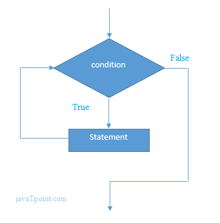

# Perl while 循环

> 原文：<https://www.javatpoint.com/perl-while-loop>

Perl **while 循环**用于多次迭代程序或语句的一部分。

在 while 循环中，条件在语句之前给出。当循环执行开始时，它首先检查条件是真还是假。如果条件为真，循环执行。如果条件为假，循环在循环外终止。

#### C 语言 while 循环的语法

Perl 语言中 while 循环的语法如下:

```

while(condition){
//code to be executed
}

```

#### Perl 中 while 循环的流程图



* * *

## Perl while 循环示例

```

$i = 1;
# while loop execution
while( $i <= 10 ){
   printf "$i\n";
   $i++;
}

```

输出:

```
1
2
3
4
5
6
7
8
9
10

```

* * *

## Perl 嵌套 while 循环示例

在嵌套 while 循环中，一个 while 循环用在另一个 while 循环中。内部 while 循环完全执行，而外部循环执行一次。

```

$i = 1;
# while loop execution
while( $i <= 3 ){
   $j = 1;
   while( $j <= 3 ){
   printf "$i $j\n";
   $j++;
}
$i++;
}

```

输出:

```
1 1
1 2
1 3
2 1
2 2
2 3
3 1
3 2
3 3

```

* * *

## Perl 无限循环示例

若要创建无限 while 循环，请将 true 作为测试条件。按 **ctrl + c** 停止循环执行。

```

while(true)
{
	printf"Infinitive While Loop\n";
}

```

输出:

```
Infinitive While Loop 
Infinitive While Loop
Infinitive While Loop
Infinitive While Loop
Infinitive While Loop
ctrl+c

```