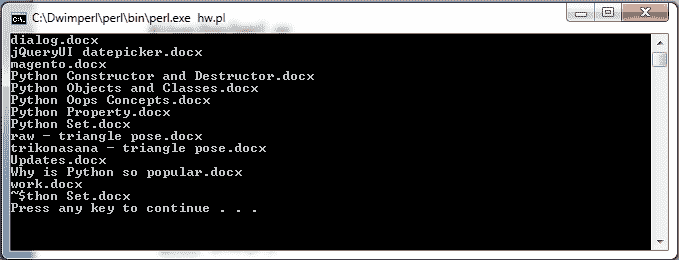

# Perl 目录

> 原文：<https://www.javatpoint.com/perl-directories>

不同的操作系统有不同的命令来查看目录中的文件列表。例如，“li”命令用于 Linux，“dir”命令用于 Windows。

但是我们也可以使用 Perl 目录函数在 Perl 中打开一个目录。这里，目录处理与文件处理非常相似。

Perl 为目录提供了两种选择:文件 globbing 和目录函数。文件 globbing 通常用于类似的文件子集，而目录函数提供了更多的选项。

## Perl 目录函数

在给定的表中，我们列出了一些目录函数。

| 功能 | 使用 |
| opendir DIRHANDLE，EXPR | 它会打开一个目录。 |
| readdir DIRHANDLE | 它读取一个目录。 |
| DIRHANDLE Rewindland | 它将指针定位到开头。 |
| 告诉你怎么做 | 它返回目录的当前位置 |
| seekdir DIRHANDLE，POS | 它将指针指向目录中的位置。 |
| closedir DIRHANDLE(关闭 dirhandle) | 它关闭一个目录。 |

* * *

## 打开/显示目录

在 Perl 中打开一个目录，有一个函数 **opendir** 。该函数在成功时返回真，在失败时返回假。

设置 **$！**用实际错误信息将显示失败原因。

**语法:**

```
opendir(DIR, 'dirName') or die;

```

**示例:**

```
#!/usr/bin/perl
my $directory = '/users/javatpoint';
opendir (DIR, $directory) or die "Couldn't open directory, $!";
while ($file = readdir DIR) {
  print "$file\n";
}
closedir DIR;

```

输出:


* * *

## 创建目录

要在 Perl 中创建新目录，有一个函数 **mkdir** 。您需要创建目录所需的权限。

**语法:**

```
mkdir(dirName) or die;

```

**示例:**

```
#!/usr/bin/perl
my $directory = '/users/javatpoint/perl';
#creating directory perl
mkdir( $directory ) or die "Couldn't create $directory directory, $!";
print "Directory created successfully\n";

```

输出:

```
Directory created successfully

```

给定的快照显示了在**/用户/javatpoint** 目录列表中创建的目录 **perl** 。


* * *

## 标量上下文中的 Perl 读取目录

要读取目录的内容，使用函数 **readdir** 。在标量上下文中，这个函数将逐个返回目录中的每一项。一旦所有内容被读出，它将返回**unde**。

**语法:**

```
while (my $directory = readdir $dh) {
    say $directory;
}

```

**示例:**

```
use strict;
use warnings;
use 5.010;
my $directory = shift // '/users/javatpoint';
opendir my $dh, $directory or die "Could not open '$directory' for reading '$!'\n";
while (my $content = readdir $dh) {
    say $content;
}
closedir $dh;

```

**输出:**


* * *

## 列表上下文中的 Perl 读取目录

在列表上下文中， **readdir** 函数将在一条语句中返回目录的所有内容。所以它使用更多的内存。

**语法:**

```
my @directory = readdir $dh;
foreach my $directory (@directory) {
    say $directory;
}

```

**示例:**

```
use strict;
use warnings;
use 5.010;
 my $directory  = shift // '/users/javatpoint';
opendir my $dh, $directory or die "Could not open '$directory' for reading '$!'\n";
my @content = readdir $dh;
foreach my $content (@content) {
    say $content;
}
closedir $dh;

```

**输出:**


* * *

## Perl 删除目录

要删除 Perl 中的一个目录，有一个函数 **rmdir** 。您需要所需的权限才能删除目录。要删除的目录在删除前应该是空的。

**语法:**

```
rmdir('dirName') or die;

```

**示例:**

```
#!/usr/bin/perl
$directory = "/users/javatpoint/perl";
# This removes perl directory from /tmp directory.
rmdir( $directory ) or die "Couldn't remove $directory directory, $!";
print "Directory removed successfully\n";

```

输出:

```
Directory removed successfully

```

* * *

## Perl 更改目录

要在 Perl 中更改目录，有一个函数 **chdir** 。要更改目录并进入新目录，您需要所需的权限。

**语法:**

```
chdir('dirName') or die;

```

**示例:**

```
#!/usr/bin/perl
$directory = "/users/";
# TThe directory changes to users.
chdir( $directory ) or die "Couldn't go inside $directory directory, $!";
print "Diretory has been changed to $directory\n"

```

输出:

```
Diretory has been changed to /users/

```

* * *

## Perl 关闭目录

要关闭 Perl 中的一个目录，有一个函数 **closedir** 。这个功能正式关闭了目录句柄和目录之间的连接。虽然，在 Perl 中关闭目录不是强制性的，因为当变量超出范围时，目录将自动关闭。

**语法:**

```
closedir $dh;
	OR
closedir DIR;

```

* * *

## 使用文件 Globbing 打开目录

要打开目录中与特定模式匹配的所有文件，请使用 Perl 文件名 **glob** 匹配模式语法。

我们将显示所有扩展名为**的文件列表。docx** 中的一个目录。

```
#!/usr/bin/perl -w
opendir(DIR, ".");
@files = grep(/\.docx$/,readdir(DIR));
closedir(DIR);
foreach $file (@files) {
   print "$file\n";
}

```

输出:



在上面的输出中，所有的文件都是在目录中读取的，但是 grep 只传递带有**的文件。docx** 扩展。