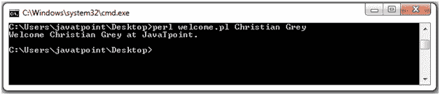
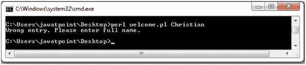
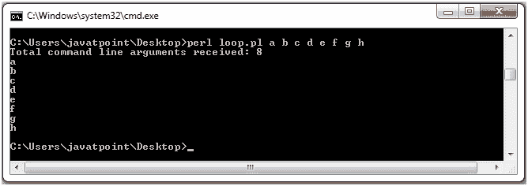
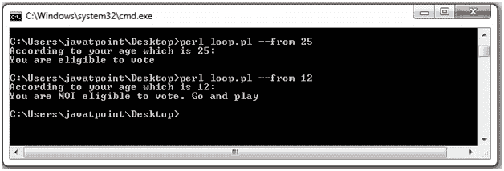

# Perl 命令行参数

> 原文：<https://www.javatpoint.com/perl-command-line-arguments>

命令行参数以与任何其他语言相同的方式发送给一个 Perl 程序。@ARGV 数组保存命令行参数。即使使用“使用严格”也没有必要使用变量。默认情况下，该变量始终存在，命令行中的值会自动放在该变量中。要访问脚本的命令行参数，只需从@ARGV 数组中读取即可。

Perl 允许通过使用<>使用@ARGV 数组作为文件名。$ARGV 包含从<>读取时当前文件的名称。

## @ARGV 数组元素

@ARGV 数组的工作方式与普通数组相同。它的第一个参数将是$ARGV[0]，第二个参数是$ARGV[1]，依此类推。

* * *

## Perl 命令行参数示例

让我们看一个打印命令行参数的简单例子。在本例中，我们将从命令行打印一条欢迎消息，以用户名作为参数。我们需要两个命令行参数作为用户的名和姓。

**步骤 1** 在你的系统中创建一个脚本 **welcome.pl** 。

```
#!/usr/bin/perl -w
# (1) check for the number of command-line arguments entered
$number_args = $#ARGV + 1;
if ($number_args != 2) {
    print "Wrong entry. Please enter your full name.\n";
    exit;
}
# (2) if two command line arguments received,
$firstName=$ARGV[0];
$lastName=$ARGV[1];
print "Welcome $firstName $lastName at JavaTpoint.\n";

```

在上面的脚本中，首先它将检查是否提供了两个命令行参数。如果没有，它会给出错误的输入错误。如果是，它会将这些参数分别处理为$ARGV[0]和$ARGV[1]。

第二步在你的控制台上运行脚本作为**perl welcome . pl Christian Grey**

#### 注意:在给出这个命令之前，请确保您在包含脚本 welcome.pl 的目录中



这是您将在控制台中获得的输出。

第二步在你的控制台上运行脚本作为 **perl welcome.pl Christian**

这里，我们只从命令行传递一个参数。



在输出中，您可以看到传递一个参数的错误输入消息。

* * *

## 使用循环的 Perl 命令行参数示例

现在我们将运行一个循环来打印命令行参数。在本例中，您可以输入任意多的参数。

**步骤 1** 在系统中创建一个脚本 **loop.pl** 。

```
#!/usr/bin/perl
$get_args = $#ARGV + 1;
print "Total command line arguments received: $get_args\n";
foreach $argument (0 .. $#ARGV) {
    print "$ARGV[$argument]\n";
}

```

**步骤 2** 在你的控制台中运行脚本为 **perl loop.pl a b c d e f g h**



看看上面的输出，它还显示了命令行上传递的所有参数。这里我们已经传递了 8 个参数。

* * *

## perl getpt::long

简单的命令行选项是使用？s 选项。复杂的命令行选项是使用 Getopt::Std 和 Getopt::Long 完成的。

Getopt 代表 **GetOptions** 。它根据我们给它的配置来处理@ARGV 的内容。它根据处理返回真值或假值。

**示例:**

在这个例子中，我们可以从命令行获得用户的年龄。

```
use strict;
use warnings;
use 5.010;
use Getopt::Long qw(GetOptions);
my $x;
GetOptions('from=s' => \$x) or die "Usage: $0 --from NAME\n";
say"According to your age which is $x:";
if ($x >=18) {
   say "You are eligible to vote";
} 

```

我们已经声明了一个变量 **$x** ，它将存储从标准控制台的插入到**中的值。 **from=s** 声明名为 **- from** 的命令行参数，后面有一个字符串。它被进一步映射到变量$x。反斜杠 **(\)** 表示我们正在传递对该变量的引用。**

这个脚本将切换到 **die** 部分，只有当我们通过传递一个看起来像参数名并且以 **(-)** 开头但没有在这个脚本中声明的东西来运行这个脚本的时候。

现在，我们将运行这个程序。

输出:



看输出，在控制台上输入 age 后，我们得到了上面的输出。