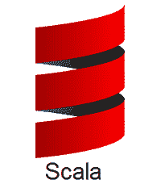
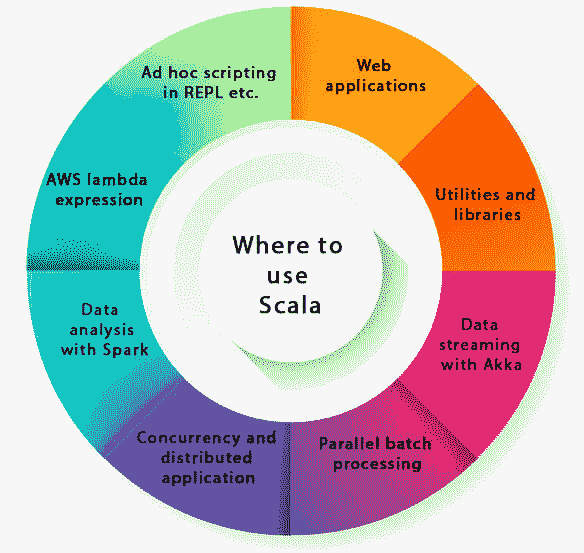

# Scala 教程

> 原文：<https://www.javatpoint.com/scala-tutorial>



Scala 教程提供了 Scala 的基本和高级概念。我们的 Scala 教程是为初学者和专业人士设计的。

Scala 是一种*面向对象*和*函数式编程*语言。

我们的 Scala 教程包括 Scala 语言的所有主题，如数据类型、条件表达式、注释、函数、oops 概念示例、构造函数、方法重载、这个关键字、继承、final、异常处理、文件处理、元组、字符串、字符串插值、案例类、单例对象、集合等。

## 什么是 Scala

Scala 是一种通用编程语言。它支持面向对象、函数式和命令式编程方法。它是一种强静态类型语言。在 scala 中，无论是函数还是数字，一切都是对象。它没有原始数据的概念。

它是由马丁·奥德斯基设计的。它于 2004 年初为 java 平台正式发布。Net 框架于 2004 年 6 月发布。后来，Scala 放弃了。2012 年净支持。

Scala 受到 Java、Haskell、Lisp、Pizza 等的影响。并影响到 F#、Fantom、Red 等。

scala 源文件的文件扩展名可以是。scala 或. sc。

您可以创建任何类型的应用程序，如 web 应用程序、企业应用程序、移动应用程序、基于桌面的应用程序等。

* * *

## Scala 程序示例

让我们看看 scala 的简单程序。这个程序的详细描述将在接下来的章节中给出。

```
object MainObject{
    def main(args:Array[String]){
		print("Hello Scala")
    }
}

```

* * *

## 在哪里使用 Scala

*   Web 应用程序
*   实用程序和库
*   使用 Akka 进行数据流传输
*   并行批处理
*   并发和分布式应用
*   使用 Spark 进行数据分析
*   AWS 表达式
*   REPL 的临时脚本等。



在 Scala 中，您可以用更少的时间和编码创建任何类型的应用程序，无论是基于网络的、基于移动的还是基于桌面的应用程序。Scala 为您提供了强大的工具和 API，您可以使用它们来创建应用程序。在这里，您可以使用 play 框架，它提供了一个快速构建 web 应用程序的平台。

* * *

## Scala指数

* * *

**教学量表**

*   [教学量表](scala-tutorial)
*   [Scala历史](history-of-scala)
*   [Scala 功能](features-of-scala)
*   [Scala Hello 程序](simple-program-of-scala)
*   [变量和数据类型](scala-variable-and-data-types)
*   [条件表达式](scala-conditional-expressions)
*   [Scala 模式匹配](scala-pattern-matching)
*   [Scala While Loop](scala-while-loop)
*   [循环的标量](scala-for-loop)
*   [Scala中断声明](scala-break)
*   [Scala评论](scala-comments)

**标量函数**

*   [标量函数](scala-functions)
*   [高阶函数](scala-higher-order-functions)

**Scala OOPs 概念**

*   [标量对象和类](scala-object-and-class)
*   [单例和伴随对象](scala-singleton-and-companion-object)
*   [案例类&对象](scala-case-classes-and-case-object)
*   [Scala 构造函数](scala-constructor)
*   [Scala 方法重载](scala-method-overloading)
*   [Scala 这个关键词](scala-this)
*   [Scala继承](scala-inheritance)
*   [Scala 方法覆盖](scala-method-overriding)
*   [标量场覆盖](scala-field-overriding)
*   [Scala决赛](scala-final)

**Scala 抽象类**

*   [Scala 抽象类](scala-abstract-class)

笔画比例

*   笔画比例
*   混合线刻度

**Scala 访问修饰符**

*   [Scala 访问修饰符](scala-access-modifier)

**Scala阵列**

*   [Scala阵列](scala-array)
*   [多维数组](scala-multidimensional-array)

**Scala弦**

*   [Scala弦](scala-string)
*   [Scala 字符串方法](scala-string-methods)
*   [标量字符串插值](scala-string-interpolation)

**Scala 异常**

*   [Scala 异常处理](scala-exception-handling)
*   [Scala试抓块](scala-try-catch)
*   [Scala最终阻断](scala-finally-block)
*   [Scala Throw 关键字](scala-throw-keyword)
*   [Scala 抛出关键字](scala-throws-keyword)
*   [Scala 自定义异常](scala-custom-exception)

**Scala系列**

*   [Scala收藏](scala-collection)
*   [Scala 集](scala-set)
*   [比例 HashSet](scala-hashset)
*   比特集刻度
*   [Scala ListSet](scala-listset)
*   比例序列
*   [标量向量](scala-vector)
*   [Scala列表](scala-list)
*   秤尾
*   [Scala溪](scala-stream)
*   [Scala地图](scala-maps)
*   [哈希图比例](scala-hashmap)
*   [量表图](scala-listmap)

**标量元组**

*   [比例元组](scala-tuples)
*   [标量元组示例](scala-tuple-example)

**Scala 文件处理**

*   [Scala 文件处理](scala-file-handling)

**多执行绪量表**

*   [多执行绪量表](scala-multithreading)
*   [Scala螺纹](scala-thread)
*   [Scala 螺纹方法](scala-thread-methods)

**Scala面试**

*   [Scala面试问题]( scala-interview-questions)

akka 教程

*   akka 教程

* * *

## 先决条件

在学习 Scala 之前，你必须具备 C 和 Java 的基础知识。

## 观众

我们的 Scala 教程旨在帮助初学者和专业人士。

## 问题

我们保证您在本 Scala 教程中不会发现任何问题。但是如果有任何错误，请在联系表格中发布问题。