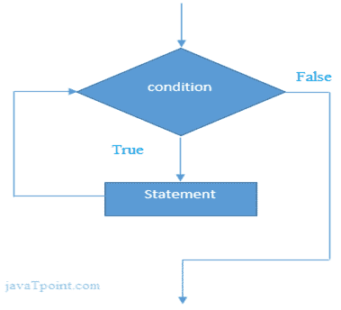

# Scala while 循环

> 原文：<https://www.javatpoint.com/scala-while-loop>

在 Scala 中，while 循环用于迭代代码直到指定的条件。它测试布尔表达式并反复迭代。如果您不知道之前的迭代次数，建议您使用 while 循环。

**语法**

```

while(boolean expression){
	// Statements to be executed
}

```

### 流程图:



## Scala while 循环示例

```

object MainObject {
   def main(args: Array[String]) {
      var a = 10;      	 				// Initialization
      while( a<=20 ){      			// Condition
         println(a);
         a = a+2               			// Incrementation
      }
   }
}

```

输出:

```
10
12
14
16
18
20

```

* * *

## Scala 无限循环示例

您也可以创建一个无限 while 循环。在下面的程序中，我们只是在 while 循环中通过了*真*。使用无限循环时要小心。

```

object MainObject {
   def main(args: Array[String]) {
      var a = 10;       	// Initialization
      while( true ){    	// Condition
         println(a);
         a = a+2        	// Incrementation
      }
   }
}

```

输出:

```
10
12
14
16
...
Ctr+Z	// To stop execution

```

* * *

## Scala 边做边循环示例

```

object MainObject {
   def main(args: Array[String]) {
        var a = 10;         // Initialization
        do {
            println( a );
            a = a + 2;      // Increment
        }
        while( a <= 20 )     // Condition
   }
}

```

输出:

```
10
12
14
16
18
20

```

* * *

## 无限边做边循环

在 scala 中，您可以创建无限的 do-while 循环。要创建无限循环，只需在循环条件中传递 *true* 文字。

我们来看一个例子。

```

object MainObject {
   def main(args: Array[String]) {
        var a = 10;         				// Initialization
        do {
            println( a );
            a = a + 2;      				// Increment
        }
        while( true)    					 // Condition
   }
}

```

输出:

```
10
12
14
16
...
Ctrl+Z	// To stop execution of program

```