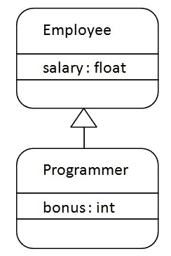
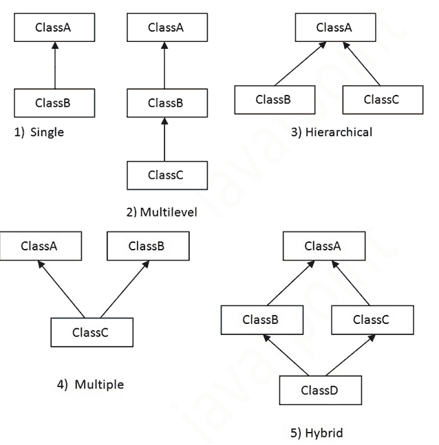

# Scala 继承

> 原文：<https://www.javatpoint.com/scala-inheritance>

继承是一个面向对象的概念，用于代码的可重用性。您可以通过使用 extends 关键字来实现继承。为了实现继承，一个类必须扩展到其他类。被扩展的类称为超类或父类。扩展类的类称为派生类或基类。

**Syntax**

```

class SubClassName extends SuperClassName(){
/* Write your code 
*  methods and fields etc.
 */
 }

```

### 理解继承的简单例子



* * *

## Scala 单一继承示例

```

class Employee{
    var salary:Float = 10000
}

class Programmer extends Employee{
    var bonus:Int = 5000
    println("Salary = "+salary)
    println("Bonus = "+bonus)
}

object MainObject{
    def main(args:Array[String]){
        new Programmer()
    }
}

```

输出:

```
Salary = 10000.0
Bonus = 5000

```

* * *

## Scala 中的继承类型

Scala 支持各种类型的继承，包括单继承、多继承、多继承和混合继承。你可以在你的班级里使用单级，多级和分级的。多重和杂交只能通过利用性状来实现。在这里，我们用图像的形式来表示所有类型的继承。



* * *

## Scala 多级继承示例

```

class A{
    var salary1 = 10000
}

class B extends A{
    var salary2 = 20000
}

class C extends B{
    def show(){
        println("salary1 = "+salary1)
        println("salary2 = "+salary2)
    }
}

object MainObject{
    def main(args:Array[String]){{  
        var c = new C()
        c.show()

    }
}

```

输出:

```
salary1 = 10000
salary2 = 20000

```