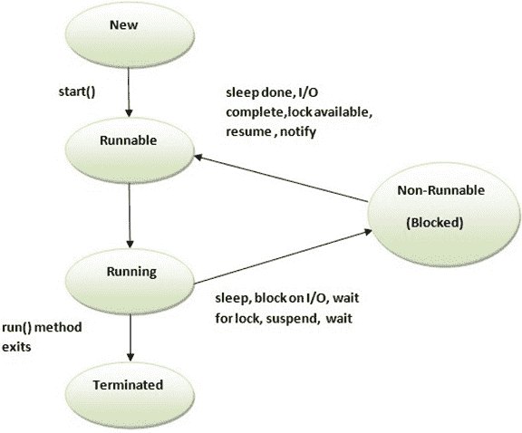

# Scala 多线程

> 原文：<https://www.javatpoint.com/scala-multithreading>

多线程是同时执行多个线程的过程。它允许您独立执行多个操作。

使用多线程可以实现多任务处理。线程是占用内存较少的轻量级子进程。多线程用于在 Scala 中开发并发应用程序。

Scala 没有为创建线程提供任何单独的库。如果你熟悉 Java 的多线程概念，你就会知道除了 Scala 语言本身的语法之外，它是相似的。

您可以通过扩展线程类或可运行接口来创建线程。两者都提供了一个运行方法来提供特定的实现。

* * *

## Scala 线程生命周期

线程生命周期是线程开始和终止的时间跨度。它有不同的阶段，如新建、运行、终止、阻塞等。线程类提供了各种方法来监控线程的状态。

Scala 线程状态如下:

1.  新的
2.  可追捕的
3.  运转
4.  不可运行(阻塞)
5.  终止的

### 1)新

这是线程的第一个状态。就在新线程开始之前。

### 2)可运行

这是线程已经启动但线程调度器没有选择它作为运行线程时的状态。

### 3)跑步

如果线程调度器选择了线程，则线程处于运行状态。

### 4)不可运行(阻塞)

这是线程仍处于活动状态，但由于等待输入或资源，当前没有资格运行的状态。

### 5)终止

当线程的 run()方法退出时，线程处于终止或死状态。