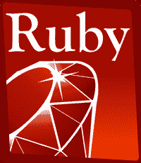

# Ruby 教程

> 原文：<https://www.javatpoint.com/ruby-tutorial>

Ruby 教程提供了 Ruby 的基本和高级概念。我们的 Ruby 编程教程是为初学者和专业人士设计的。

Ruby 是一种开源且完全面向对象的编程语言。

我们的 Ruby 教程包括 Ruby 的所有主题，例如安装、示例、运算符、控制语句、循环、注释、数组、字符串、哈希、正则表达式、文件处理、异常处理、oops、Ranges、迭代器。等等

* * *

## Ruby索引

* * *

**Ruby 教程**

*   [Ruby 教程](ruby-tutorial)
*   [什么是Ruby](what-is-ruby)
*   [Ruby特性](ruby-features)
*   [Ruby vs Python](ruby-vs-python)
*   [Ruby安装](ruby-installation)
*   [你好Ruby程序](hello-ruby-program)
*   [Ruby操作员](ruby-operators)
*   [Ruby变量](ruby-variables)
*   [Ruby数据类型](ruby-data-types)

**控制报表**

*   [Ruby if-else](ruby-if-else)
*   [Ruby表壳](ruby-case)
*   [Ruby为](ruby-for-loop)
*   [Ruby边做边玩](ruby-while-and-do-while-loop)
*   [Ruby直到](ruby-until-loop)
*   [Ruby下一次破裂](ruby-break-and-next-statement)
*   [Ruby 重做重试](ruby-redo-and-retry-statement)
*   [Ruby评论](ruby-comments)

**Ruby芯**

*   [Ruby 对象类](ruby-class-and-object)
*   [Ruby方法](ruby-methods)
*   [Ruby块](ruby-blocks)
*   [Ruby模块](ruby-modules)
*   [Ruby弦](ruby-strings)
*   [Ruby阵列](ruby-arrays)
*   [Ruby哈希](ruby-hashes)
*   [Ruby日期&时间](ruby-date-and-time)
*   [Ruby范围](ruby-ranges)
*   [Ruby 迭代器](ruby-iterators)
*   [Ruby文件输入输出](ruby-file-io)
*   [Ruby目录](ruby-directories)
*   [Ruby异常](ruby-exceptions)

**Ruby推进**

*   [Ruby OOPs](ruby-oops)
*   [Ruby Regex](ruby-regular-expression)
*   [Ruby插座](ruby-socket-programming)
*   [Ruby 多线程](ruby-multithreading)
*   [Ruby LDAP](ruby-ldap)
*   [Ruby XML](ruby-xml)
*   [Ruby XPATH XSLT](ruby-xpath-and-xslt)

**面试问题**

*   [Ruby面试](ruby-interview-questions)

**铁轨上的Ruby**

*   [铁轨上的Ruby](ruby-on-rails-tutorial)

* * *

## 先决条件

在学习 Ruby 之前，你必须具备任何编程语言的基础知识。

## 观众

我们的 Ruby 教程旨在帮助初学者和专业人士。

## 问题

我们保证您在这篇 Ruby 编程教程中不会发现任何问题。但是如果有任何错误，请在联系表格中发布问题。