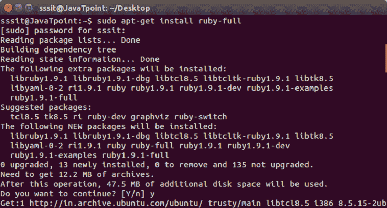
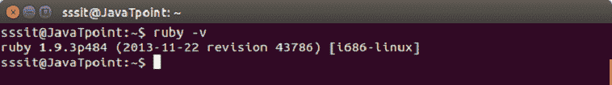

# 红宝石安装

> 原文：<https://www.javatpoint.com/ruby-installation>

Ruby 是一种跨平台编程语言。它在不同的操作系统上安装方式不同。

*   对于像操作系统这样的 UNIX，使用你的系统的**包管理器。**
*   对于 **Windows** 操作系统，使用 **RubyInstaller。**
*   对于 **OS X** 系统，使用第三方工具( **rbenv 和 RVM** )。

我们将使用**包管理器在 **Linux Ubuntu** 上安装 Ruby。**

**第一步**从[链接中选择要安装的包管理系统点击此处](https://www.ruby-lang.org/en/documentation/installation/#apt)

**第二步** Debian GNU/Linux 和 Ubuntu 使用 apt 包管理器。使用以下命令:

```
sudo apt-get install ruby-full

```

在这里，默认情况下，ruby-full 包提供了 Ruby 1.9.3 版本，这是 Debian 和 Ubuntu 上的一个旧版本。



**第 3 步**要了解系统中安装的 Ruby 版本，请使用命令，

```
ruby -v

```

