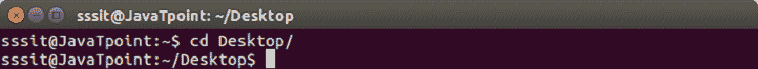
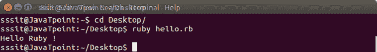

# 你好Ruby程序

> 原文：<https://www.javatpoint.com/hello-ruby-program>

现在我们将编写一个简单的 Ruby 程序。在编写 Hello World 程序之前，我们假设您已经在系统中成功安装了 Ruby。

* * *

## 你好Ruby程序的要求

*   下载 Ruby 并安装。
*   用**创建文件。rb** 分机。
*   将 Ruby 路径连接到文件。
*   运行文件。

* * *

## 创建你好Ruby程序

1)使用任何文本编辑器并创建 hello.rb 文件。编写以下代码，

```

puts "Hello Ruby !"

```

2)将 Ruby 路径连接到上面的文件。我们已经在桌面中创建了 hello.rb 文件。因此，首先我们需要通过控制台浏览桌面目录。



3)运行以下命令。

```

ruby hello.rb

```



这是我们的 Hello Ruby 程序的最终输出。

* * *