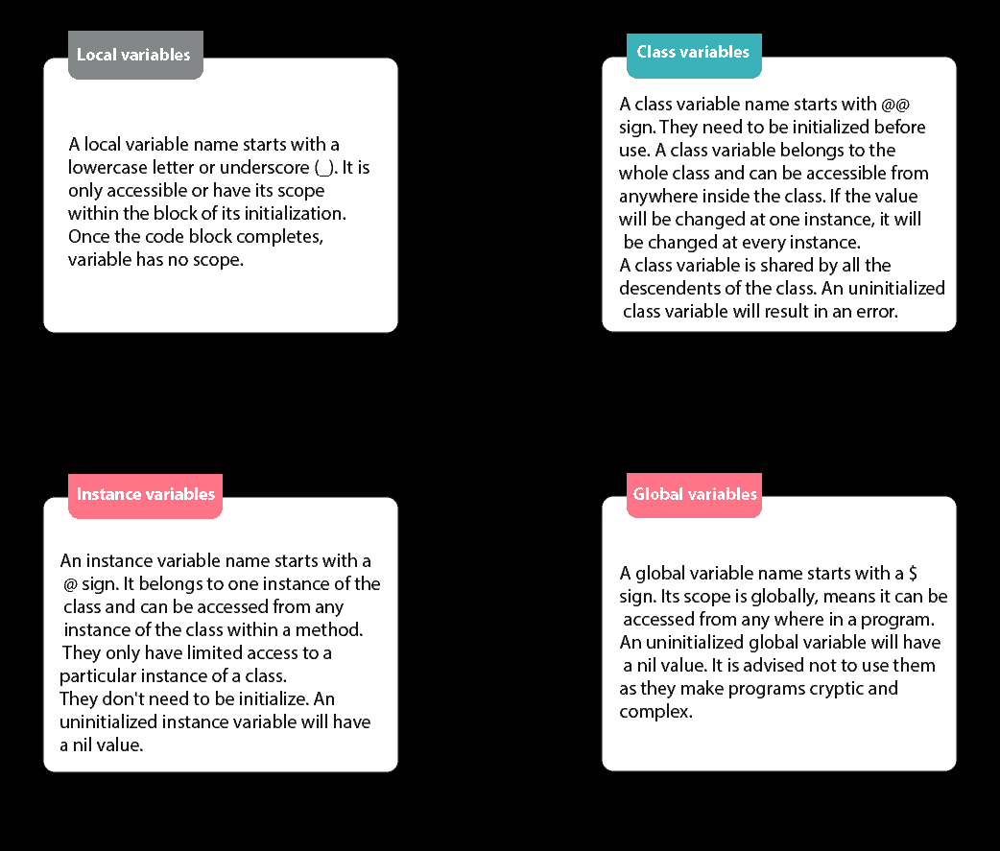
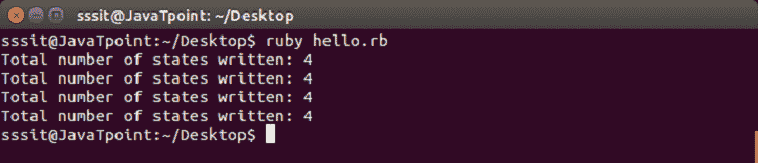
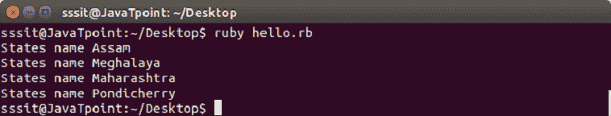
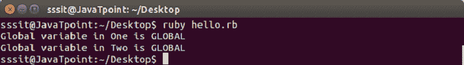

# Ruby变量

> 原文：<https://www.javatpoint.com/ruby-variables>

Ruby 变量是保存程序中使用的数据的位置。每个变量都有不同的名称。这些变量名基于一些命名约定。与其他编程语言不同，没有必要在 Ruby 中声明变量。需要一个前缀来表示它。

Ruby 中有四种类型的变量:

*   局部变量
*   类变量
*   实例变量
*   全局变量



* * *

## 局部变量

局部变量名以小写字母或下划线(_)开头。它只能被访问，或者其作用域在它的初始化块内。一旦代码块完成，变量就没有作用域。

当调用未初始化的局部变量时，它们被解释为对没有参数的方法的调用。

* * *

## 类变量

类变量名以@@符号开头。它们需要在使用前初始化。类变量属于整个类，可以从类内的任何地方访问。如果该值将在一个实例中更改，它将在每个实例中更改。

类变量由该类的所有后代共享。未初始化的类变量将导致错误。

**示例:**

```
#!/usr/bin/ruby 

class States 
   @@no_of_states=0 
   def initialize(name) 
      @states_name=name 
      @@no_of_states += 1 
   end 
   def display() 
     puts "State name #@state_name" 
	end 
    def total_no_of_states() 
       puts "Total number of states written: #@@no_of_states" 
    end 
end 

# Create Objects 
first=States.new("Assam") 
second=States.new("Meghalaya") 
third=States.new("Maharashtra") 
fourth=States.new("Pondicherry") 

# Call Methods 
first.total_no_of_states() 
second.total_no_of_states() 
third.total_no_of_states() 
fourth.total_no_of_states()

```

在上面的例子中，@@no_of_states 是一个类变量。

输出:



* * *

## 实例变量

实例变量名以@符号开头。它属于该类的一个实例，并且可以从方法中该类的任何实例进行访问。他们只能有限地访问一个类的特定实例。

它们不需要初始化。未初始化的实例变量将具有零值。

**示例:**

```
#!/usr/bin/ruby 

class States 
   def initialize(name) 
      @states_name=name 
   end 
   def display() 
      puts "States name #@states_name" 
	end 
end 

# Create Objects 
first=States.new("Assam") 
second=States.new("Meghalaya") 
third=States.new("Maharashtra") 
fourth=States.new("Pondicherry") 

# Call Methods 
first.display() 
second.display() 
third.display() 
fourth.display()

```

在上面的例子中，@states_name 是实例变量。

输出:



* * *

## 全局变量

全局变量名以$符号开头。它的范围是全局的，意味着它可以从程序中的任何地方访问。

未初始化的全局变量将具有零值。建议不要使用它们，因为它们会使程序变得神秘和复杂。

Ruby 中有许多预定义的全局变量。

**示例:**

```
#!/usr/bin/ruby 

$global_var = "GLOBAL" 
class One 
  def display 
     puts "Global variable in One is #$global_var" 
  end 
end 
class Two 
  def display 
     puts "Global variable in Two is #$global_var" 
  end 
end 

oneobj = One.new 
oneobj.display 
twoobj = Two.new 
twoobj.display

```

在上面的例子中，@states_name 是实例变量。

输出:



* * *

## 摘要

|  | 当地的 | 全球的 | 情况 | 班级 |
| 范围 | 限制在初始化块内。 | 它的范围是全球性的。 | 它属于一个类的一个实例。 | 仅限于创建它们的整个类。 |
| 命名 | 以小写字母或下划线(_)开头。 | 以$符号开始。 | 以@符号开头。 | 以@@符号开始。 |
| 初始化 | 不需要初始化。未初始化的局部变量被解释为没有参数的方法。 | 不需要初始化。未初始化的全局变量将具有零值。 | 不需要初始化。未初始化的实例变量将具有零值。 | 它们需要在使用前初始化。未初始化的全局变量会导致错误。 |