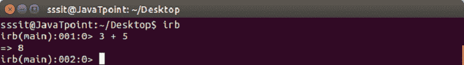
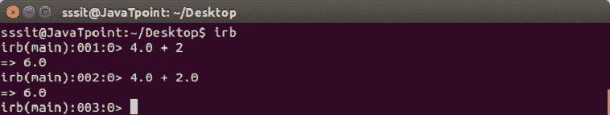
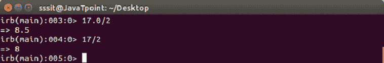
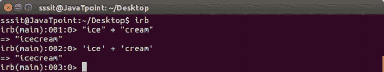
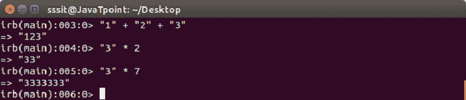
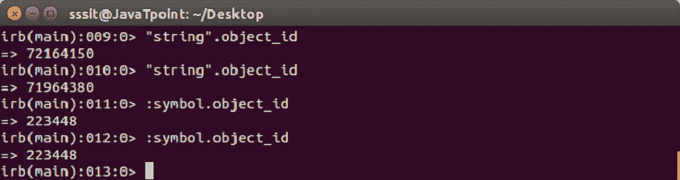
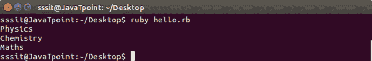
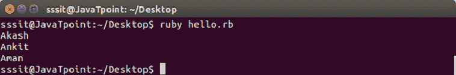

# 红宝石数据类型

> 原文：<https://www.javatpoint.com/ruby-data-types>

数据类型代表一种数据类型，如文本、字符串、数字等。Ruby 中有不同的数据类型:

*   民数记
*   用线串
*   标志
*   混杂
*   数组
*   布尔运算

* * *

## 民数记

整数和浮点数属于数字的范畴。

整数以二进制形式保存在内部。整数是没有分数的数字。根据它们的大小，有两种类型的整数。一个是 Bignum，一个是 Fixnum。

| 班级 | 描述 | 例子 |
| 固定的 | 它们是正常的数字 | one |
| 比格纳姆 | 它们是很大的数字 | One hundred and eleven billion one hundred and eleven million one hundred and eleven thousand one hundred and eleven |
| 浮动 | 小数 | Three |
| 复杂的 | 虚数 | 4 + 3i |
| 合理的 | 它们是分数 | 9/4 |
| BigDecimal(大十进制) | 精确十进制数 | Six |

**示例:**

*   在计算中，如果使用整数，那么只返回整数。


*   在计算中，如果使用浮点类型，那么只有浮点将返回。


*   如果发生 dvision，将出现以下输出。


* * *

## 用线串

字符串是代表一个句子或一个单词的一组字母。字符串是通过在单引号(')或双引号(")中包含文本来定义的。

**示例:**

*   两个字符串可以使用 **+** 号连接在一起。


*   将一个数字字符串乘以一个数字将会重复该字符串多次。


* * *

## 标志

符号就像琴弦。符号前面有一个冒号(:)。例如，

```

:abcd

```

它们不包含空格。包含多个单词的符号用(_)书写。字符串和符号的一个区别是，如果文本是数据，那么它就是字符串，但是如果它是代码，那么它就是符号。

符号是唯一的标识符，代表静态值，而字符串代表变化的值。

**示例:**



在上面的快照中，为字符串创建了两个不同的 object_id，但为符号创建了相同的 object_id。

* * *

## 混杂

散列将它值分配给它的键。他们可以通过钥匙找到。键的值由 **= >** 符号指定。键/值对之间用逗号分隔，所有键/值对都包含在大括号内。例如，

{“阿卡什”= >“物理”、“安基特”= >“化学”、“阿曼”= >“数学”}

**示例:**

```

#!/usr/bin/ruby 

data = {"Akash" => "Physics", "Ankit" => "Chemistry", "Aman" => "Maths"} 
puts data["Akash"] 
puts data["Ankit"] 
puts data["Aman"]

```

输出:



* * *

## 数组

数组存储数据或数据列表。它可以包含所有类型的数据。数组中的数据之间用逗号分隔，并用方括号括起来。例如，

```

["Akash", "Ankit", "Aman"] 

```

数组中的元素按位置检索。数组中元素的位置从 0 开始。

**示例:**

```

#!/usr/bin/ruby 

data = ["Akash", "Ankit", "Aman"] 
puts data[0] 
puts data[1] 
puts data[2]

```

输出:



* * *