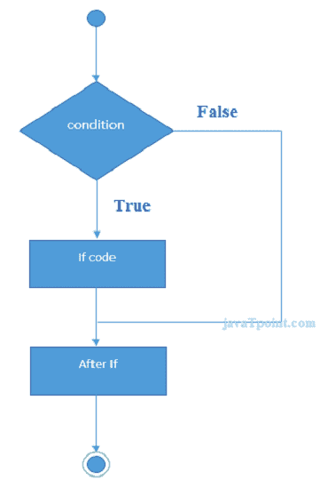
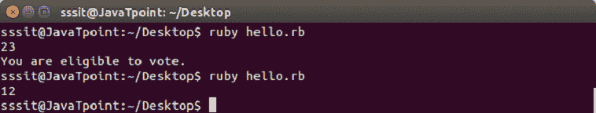
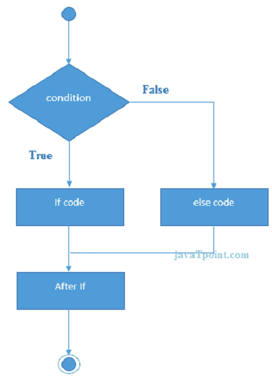
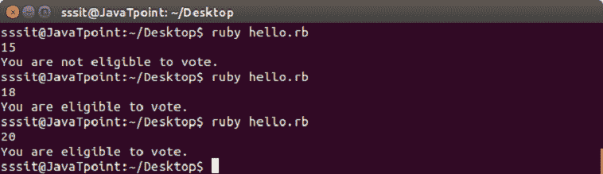
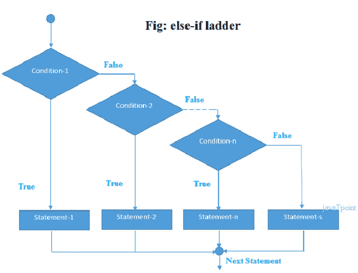
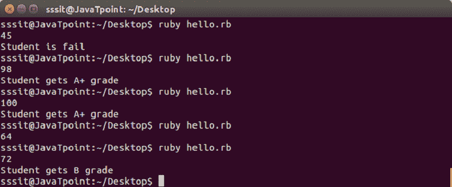
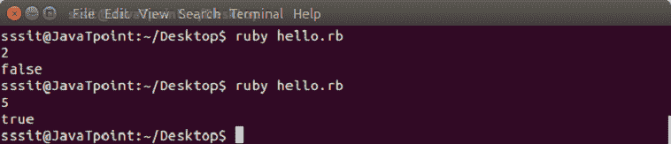

# Ruby If-else 语句

> 原文：<https://www.javatpoint.com/ruby-if-else>

Ruby if else 语句用于测试条件。Ruby 中有各种类型的 if 语句。

*   如果语句
*   if-else 语句
*   if-else-if (elsif)语句
*   ternay(if 语句的缩写)语句

* * *

## Ruby if 语句

Ruby if 语句测试条件。如果条件为真，则执行 if 块语句。

**语法:**

```

if (condition)
//code to be executed
end

```



**示例:**

```

a = gets.chomp.to_i 
if a >= 18 
  puts "You are eligible to vote." 
end

```

输出:



* * *

## Ruby if else

Ruby if else 语句测试条件。如果条件为真，则执行 if 块语句，否则执行 else 块语句。

**语法:**

```

if(condition)
	//code if condition is true
else
//code if condition is false
end

```



**示例:**

```

a = gets.chomp.to_i 
if a >= 18 
  puts "You are eligible to vote." 
else 
  puts "You are not eligible to vote." 
end

```

输出:



* * *

## Ruby if else if (elsif)

Ruby if else if 语句测试条件。如果条件为真，则执行 if 块语句，否则执行 else 块语句。

**语法:**

```

if(condition1)
//code to be executed if condition1is true
elsif (condition2)
//code to be executed if condition2 is true
else (condition3)
//code to be executed if condition3 is true
end

```



**示例:**

```

a = gets.chomp.to_i 
if a <50 
  puts "Student is fail" 
elsif a >= 50 && a <= 60 
  puts "Student gets D grade" 
elsif a >= 70 && a <= 80 
  puts "Student gets B grade" 
elsif a >= 80 && a <= 90 
  puts "Student gets A grade"  
elsif a >= 90 && a <= 100 
  puts "Student gets A+ grade"  
end

```

输出:



* * *

## 红宝石三元语句

在 Ruby 三元语句中，if 语句被缩短。首先，它计算表达式的真值或假值，然后执行其中一个语句。

**语法:**

```

test-expression ? if-true-expression : if-false-expression

```

**示例:**

```

var = gets.chomp.to_i; 
a = (var > 3 ? true : false);  
puts a 

```

输出:



* * *