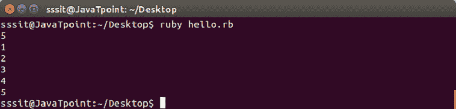
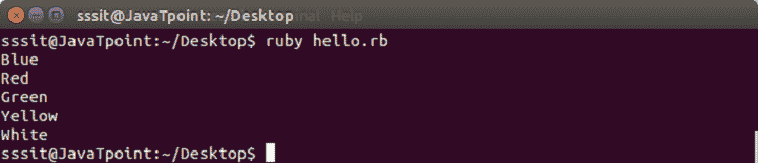

# 红宝石换循环

> 原文：<https://www.javatpoint.com/ruby-for-loop>

Ruby for 循环在特定的数字范围内迭代。因此，如果程序具有固定的迭代次数，则使用 for 循环。

Ruby for 循环将对表达式中的每个元素执行一次。

**语法:**

```

for variable [, variable ...] in expression [do]
   code
end

```

* * *

## Ruby for 循环使用范围

**示例:**

```

a = gets.chomp.to_i 
for i in 1..a do 
  puts i 
end 

```

输出:



* * *

## Ruby for 循环使用数组

**示例:**

```

x = ["Blue", "Red", "Green", "Yellow", "White"] 
for i in x do 
  puts i 
end 

```

输出:



* * *