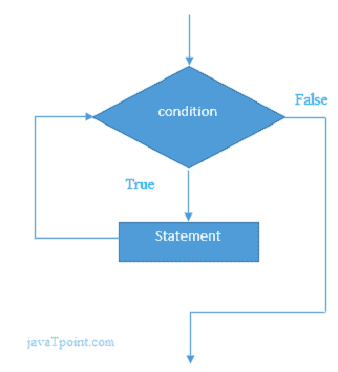
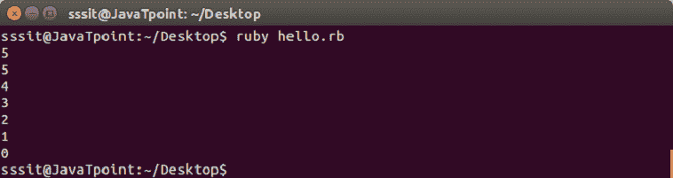
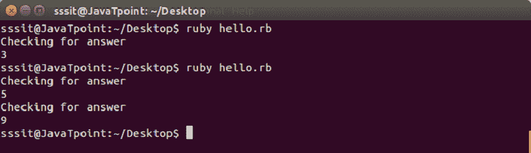

# Ruby边循环

> 原文：<https://www.javatpoint.com/ruby-while-and-do-while-loop>

Ruby while 循环用于多次迭代一个程序。如果程序的迭代次数不固定，则使用 while 循环。

Ruby while 循环在条件为真时执行条件。一旦条件变为假，while 循环将停止执行。

**语法:**

```

while conditional [do]
   code
end

```



**示例:**

```

#!/usr/bin/ruby 
x = gets.chomp.to_i 
while x >= 0	 
  puts x 
  x -=1 
end 

```

输出:



* * *

## 鲁比边循环边做

Ruby do while 循环多次迭代程序的一部分。它非常类似于 while 循环，唯一的区别是循环将至少执行一次。这是因为在 do while 循环中，条件写在代码的末尾。

**语法:**

```

loop do 
  #code to be executed
  break if booleanExpression
end 

```

**示例:**

```

loop do 
  puts "Checking for answer" 
  answer = gets.chomp 
  if answer != '5' 
    break 
  end 
end

```

**输出:**



* * *