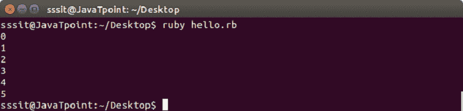

# Ruby 重做语句

> 原文：<https://www.javatpoint.com/ruby-redo-and-retry-statement>

Ruby redo 语句用于重复循环的当前迭代。重做语句在不评估循环条件的情况下执行。

重做语句在循环中使用。

**语法:**

```

redo

```

**示例:**

```

i = 0 
while(i < 5)   # Prints "012345" instead of "01234" 
  puts i 
  i += 1 
   redo if i == 5 
end 

```

输出:



* * *

## Ruby 重试语句

Ruby retry 语句用于从头开始重复整个循环迭代。

retry 语句在循环中使用。

**语法:**

```

retry

```