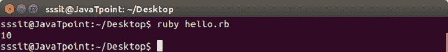
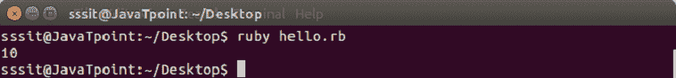

# Ruby评论

> 原文：<https://www.javatpoint.com/ruby-comments>

Ruby 注释是程序中不可执行的行。解释器会忽略这些行，因此它们不会在执行程序时执行。它们是由程序员编写的，用于解释他们的代码，以便其他查看代码的人能够以更好的方式理解它。

Ruby 注释的类型:

*   单行注释
*   多行注释

* * *

## Ruby单行注释

Ruby 单行注释用于一次只注释一行。它们用 **#** 字符定义。

**语法:**

```

#This is single line comment.

```

**示例:**

```

i = 10  #Here i is a variable. 
puts i

```

输出:



Ruby 多行注释用于一次注释多行。它们的定义是**=在起点开始**，在线路的终点结束**=结束**。

**语法:**

```

=begin
	This
	is
	multi line
	comment
=end

```

**示例:**

```

=begin 
we are declaring 
a variable i 
in this program 
=end 
i = 10 
puts i

```

输出:



* * *