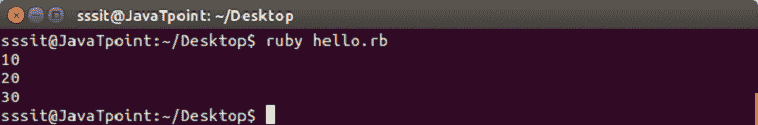
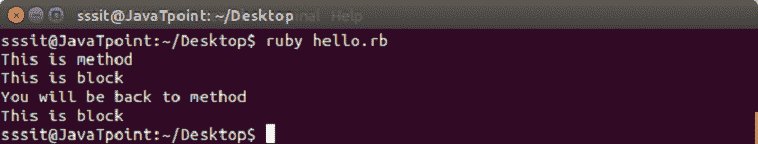
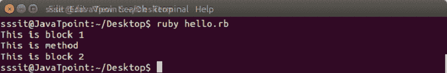
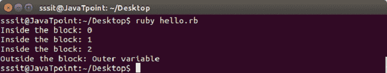
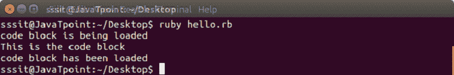
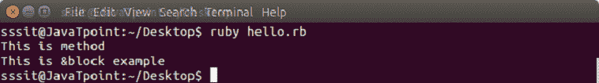

# Ruby块

> 原文：<https://www.javatpoint.com/ruby-blocks>

在其他编程语言中，Ruby 代码块被称为闭包。它由一组代码组成，这些代码总是用括号括起来或者写在 **do 之间..结束。**大括号语法总是比 do 具有更高的优先级..结束语法。大括号优先级高，do 优先级低。

一个块有两种写方式，

*   do 和 end 之间的多行(多行块是 niot 内联)
*   大括号之间的内联{}

两者相同，功能相同。

要调用一个块，需要有一个与该块同名的函数。

块总是用函数调用。块可以有自己的参数。

**语法:**

```

block_name{
   statement1
   statement2
   ..........
}

```

**示例:**

下面的例子展示了**多行**块。

```

[10, 20, 30].each do |n| 
 puts n 
end 

```

输出:



下面的例子显示了**内联**块。

```

[10, 20, 30].each {|n| puts n}

```

输出:


* * *

## 收益率报表

yield 语句用于调用具有值的方法中的块。

**示例:**

```

#!/usr/bin/ruby 

def met 
   puts "This is method" 
   yield 
   puts "You will be back to method" 
   yield 
end 
met {puts "This is block"}

```

输出:



当**的执行满足**方法时，当我们到达屈服线时，块内的代码被执行。当块执行完成时，met 方法的代码继续。

**用收益率报表传递参数**

yield 语句可以传递一个或多个参数。

**示例:**

```

#!/usr/bin/ruby 

def met 
   yield 1 
   puts "This is method" 
   yield 2 
end 
met {|i| puts "This is block #{i}"} 

```

输出:



* * *

## 块变量

我们可以在块参数的外部和内部使用相同的变量。让我们看看下面的例子。

**示例:**

```

#!/usr/bin/ruby 

    x = "Outer variable"  
    3.times do |x|  
      puts "Inside the block: #{x}"  
    end  
    puts "Outside the block: #{x}"

```

输出:



在本例中，我们将块内的同一个变量用作块参数 x，块外的同一个变量用作变量 x。

* * *

## 开始和结束块

Ruby BEGIN 和 END 块分别用于声明文件正在被加载和文件已经被加载。

**示例:**

```

#!/usr/bin/ruby 

BEGIN { 
  puts "code block is being loaded" 
} 

END { 
  puts "code block has been loaded" 
} 
puts "This is the code block"

```

输出:



* * *

## &符号参数(&block)

&block 是将块的引用(而不是局部变量)传递给方法的一种方式。

在这里， **&** 后面的块字只是一个参考的名字，其他任何名字都可以代替这个。

**示例:**

```

def met(&block) 
  puts "This is method" 
  block.call 
end 
met { puts "This is &block example" } 

```

输出:



这里，方法**里面的块变量 met** 是对块的引用。它是用调用方法执行的。调用方法与 yield 方法相同。

* * *

## 用默认值初始化对象

Ruby 有一个初始化器叫做 **yield(self)** 。这里，**自我**是被初始化的对象。

**示例:**

```

class Novel 
  attr_accessor :pages, :category 

  def initialize 
    yield(self) 
  end 
end 

novel = Novel.new do |n| 
  n.pages = 564 
  n.category = "thriller" 
end 

puts "I am reading a #{novel.category} novel which has #{novel.pages} pages." 

```

输出:


* * *