# 红宝石阵列

> 原文：<https://www.javatpoint.com/ruby-arrays>

Ruby 数组是对象的有序集合。它们可以保存像整数、数字、散列、字符串、符号或任何其他数组这样的对象。

它的索引从 0 开始。负索引从数组末尾的-1 开始。例如，-1 表示数组的最后一个元素，0 表示数组的第一个元素。

* * *

## 创建红宝石数组

Ruby 数组是以多种方式创建的。

*   使用文字构造函数[]
*   使用新的类方法

* * *

## 使用文字构造[]

Ruby 数组是使用文字构造函数[]构造的。单个数组可以包含不同类型的对象。

例如，下面的数组包含一个整数、浮点数和一个字符串。

```

exm = [4, 4.0, "Jose", ] 
puts exm 

```

输出:

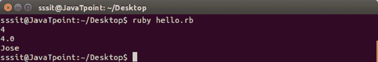

* * *

## 使用新的类方法

Ruby 数组是通过调用带有零个、一个或多个参数的::new 方法构造的。

**语法:**

```

arrayName = Array.new

```

要设置数组的大小，

**语法:**

```

arrayName = Array.new(10)

```

这里，我们提到数组大小是 10 个元素。

要知道数组的大小，可以使用 size 或 length 方法。

**示例:**

```

#!/usr/bin/ruby 

exm = Array.new(10) 
puts exm.size  
puts exm.length 

```

输出:

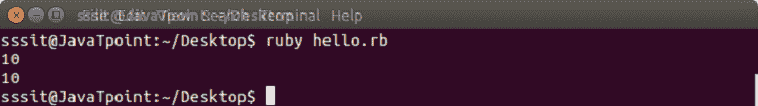

**示例:**

```

#!/usr/bin/ruby 
exm = Array("a"..."z") 
puts "#{exm}"

```

输出:

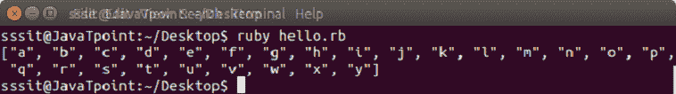

* * *

## 访问数组元素

可以使用 **#[]** 方法访问 Ruby 数组元素。您可以传递一个或多个参数，甚至一系列参数。

```

#[] method

```

**示例:**

```

days = ["Mon", "Tue", "Wed", "Thu", "Fri", "Sat", "Sun"] 
puts days[0]    
puts days[10] 
puts days[-2]   
puts days[2, 3] 
puts days[1..7] 

```

输出:

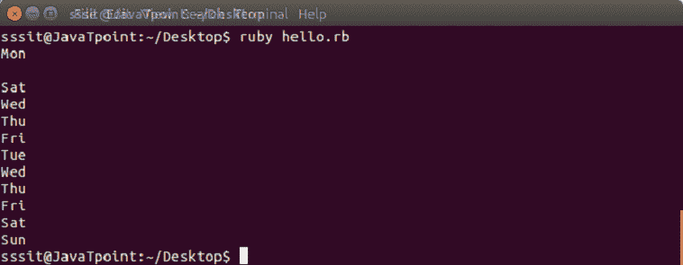

**在方法**

要访问特定元素，还可以使用 at 方法。

**示例:**

```

days = ["Mon", "Tue", "Wed", "Thu", "Fri", "Sat", "Sun"] 
puts days.at(0) 
puts days.at(-1) 
puts days.at(5) 

```

输出:

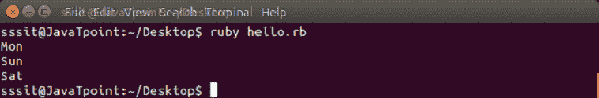

**切片法**

切片方法的工作方式类似于#[]方法。

**取法**

fetch 方法用于为超出数组范围的索引提供默认值错误。

**示例:**

```

days = ["Mon", "Tue", "Wed", "Thu", "Fri", "Sat", "Sun"] 
puts days.fetch(10)

```

输出:

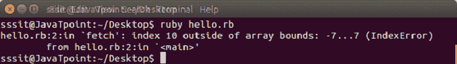

**示例:**

```

days = ["Mon", "Tue", "Wed", "Thu", "Fri", "Sat", "Sun"] 
puts days.fetch(10, "oops")

```

输出:

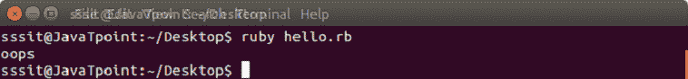

**第一个和最后一个方法**

第一个和最后一个方法将分别返回数组的第一个和最后一个元素。

**示例:**

```

days = ["Mon", "Tue", "Wed", "Thu", "Fri", "Sat", "Sun"] 
puts days.first 
puts days.last 

```

输出:

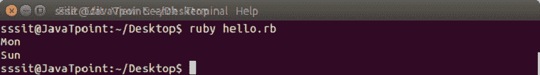

**取法**

take 方法返回数组的前 n 个元素。

**示例:**

```

days = ["Mon", "Tue", "Wed", "Thu", "Fri", "Sat", "Sun"] 
puts days.take(1) 
puts days.take(2) 

```

输出:

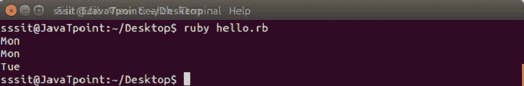

**下降法**

drop 方法与 take 方法相反。它在 n 个元素被删除后返回元素。

**示例:**

```

days = ["Mon", "Tue", "Wed", "Thu", "Fri", "Sat", "Sun"] 
puts days.drop(5) 
puts days.drop(6) 

```

输出:

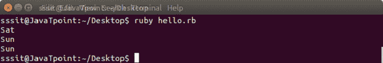

* * *

## 将项目添加到数组

Ruby 数组元素可以用不同的方式添加。

*   推送或<<
*   松开打字机或键盘的字型变换键
*   插入

* * *

## 推送或<<

使用 push 或<

**示例:**

```

days = ["Mon", "Tue", "Wed", "Thu", "Fri", "Sat", "Sun"] 
puts days.push("Today") 
puts days << ("Tomorrow") 

```

输出:

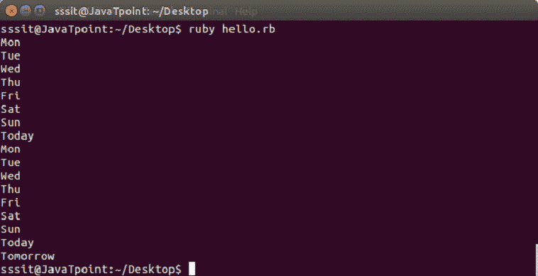

* * *

## 松开打字机或键盘的字型变换键

使用 unshift，可以在数组的开头添加新元素。

**示例:**

```

days = ["Fri", "Sat", "Sun"] 
puts days.unshift("Today") 

```

输出:

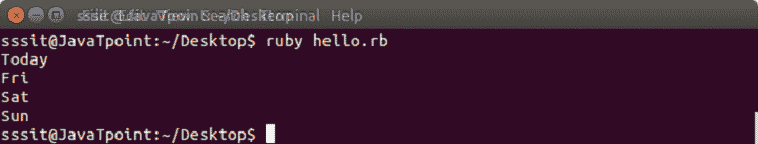

* * *

## 插入

使用 insert，可以在数组中的任何位置添加新元素。这里，首先我们需要提到我们想要定位元素的索引号。

**示例:**

```

days = ["Fri", "Sat", "Sun"] 
puts days.insert(2, "Thursday") 

```

输出:

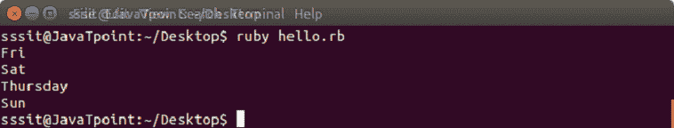

* * *

## 从数组中移除项目

Ruby 数组元素可以用不同的方式移除。

*   流行音乐
*   变化
*   删除
*   金圣柱

* * *

## 流行音乐

使用 pop，可以从数组末尾移除项。它返回移除的项目。

**示例:**

```

days = ["Fri", "Sat", "Sun"] 
puts days.pop 

```

输出:

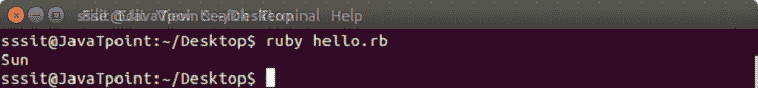

* * *

## 变化

使用 shift，可以从数组的开头移除项。它返回移除的项目。

**示例:**

```

days = ["Fri", "Sat", "Sun"] 
puts days.shift 

```

输出:

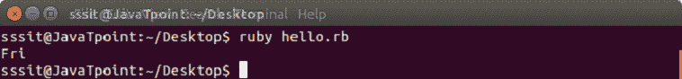

* * *

## 删除

使用 delete，可以从数组中的任何位置删除项目。它返回移除的项目。

**示例:**

```

days = ["Fri", "Sat", "Sun"] 
puts days.delete("Sat") 

```

输出:

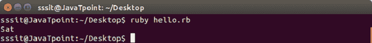

* * *

## 金圣柱

使用 uniq，可以从数组中删除重复的元素。它返回剩余的数组。

**示例:**

```

days = ["Fri", "Sat", "Sun", "Sat"] 
puts days.uniq 

```

输出:


* * *