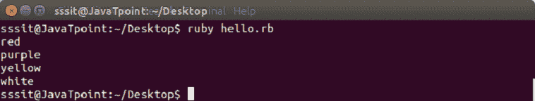
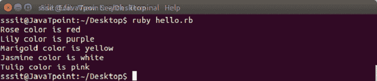

# 红宝石哈希

> 原文：<https://www.javatpoint.com/ruby-hashes>

Ruby 哈希是唯一键及其值的集合。它们类似于数组，但数组使用整数作为索引，哈希使用任何对象类型。它们也被称为关联数组、字典或地图。

如果使用不存在的键访问哈希，该方法将返回零。

**语法:**

```

name = {"key1" => "value1", "key2" => "value2", "key3" => "value3"...}
					OR
name = {key1:  'value1', key2:  'value2', key3:  'value3'...}

```

* * *

## 创建 Ruby 哈希

Ruby hash 是通过在{}个大括号内写入键值对来创建的。

要获取哈希值，请在[]方括号内写入所需的密钥。

**示例:**

```

color = { 
    "Rose" => "red", 
    "Lily" => "purple", 
    "Marigold" => "yellow", 
    "Jasmine" => "white" 
  } 
  puts color['Rose'] 
  puts color['Lily'] 
  puts color['Marigold'] 
  puts color['Jasmine']

```

输出:



* * *

## 修改红宝石哈希

可以通过在已经存在的散列中添加或移除键值对来修改 Ruby 散列。

**示例:**

```

color = { 
    "Rose" => "red", 
    "Lily" => "purple", 
    "Marigold" => "yellow", 
    "Jasmine" => "white" 
  } 
  color['Tulip'] = "pink" 
  color.each do |key, value| 
  puts "#{key} color is #{value}" 
 end

```

输出:



* * *

## 红宝石散列方法

Ruby 哈希有很多方法。有些是公共类方法，有些是公共实例方法。

### 公共类方法

| 方法 | 描述 |
| 散列[对象] | 用给定的对象创建一个新的散列。 |
| 新的 | 返回一个新的空散列。 |
| 尝试转换(obj) | 尝试将 obj 转换为 hash。 |

* * *

### 公共实例方法

| 方法 | 描述 |
| hsh = =其他 _ 哈希 | 如果两个散列包含相同的键和值对，则它们是相等的。 |
| HSH[密钥] | 从相应的键中检索值。 |
| hsh[key] =值 | 将新值与给定的键相关联。 |
| 关联(obj) | 比较散列中的对象。 |
| 清楚的 | 从哈希中删除所有键值对。 |
| 按身份比较 | 根据身份比较哈希键。 |
| 按身份比较？ | 如果哈希按其标识比较其密钥，则返回 true。 |
| 默认值(键=无) | 返回默认值。 |
| 默认= obj
 | 设置默认值。 |
| 删除(键) | 删除键值对。 |
| 每个 | 对哈希中的每个键调用 block 一次。 |
| 空的？ | 如果哈希不包含键值对，则返回 true。 |
| eql >(其他) | 如果哈希和其他都有相同的内容，则返回 true |
| 提取(键[，默认])
 | 给定键的哈希值。 |
| 变平 | 返回一个新数组，该数组是该哈希的一维展平。 |
| has_key？(键) | 如果哈希中存在给定的密钥，则返回 true。 |
| 有价值吗？(值) | 如果给定值存在于某个键的散列中，则返回 true。 |
| 包括？(键) | 如果哈希中存在给定的密钥，则返回 true。 |
| 至 _s/检查
 | 以字符串形式返回哈希的内容。 |

* * *