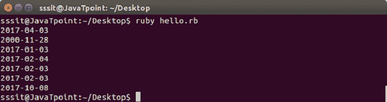
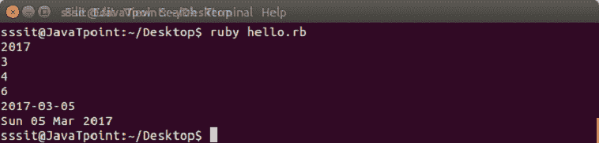
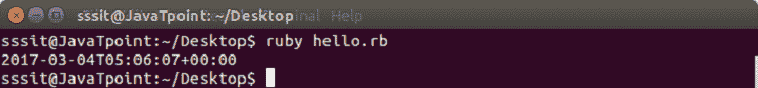
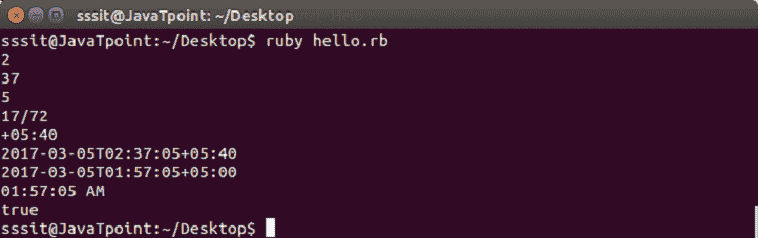
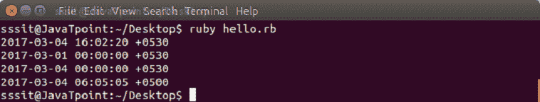
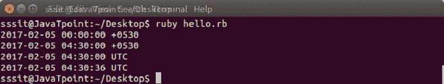
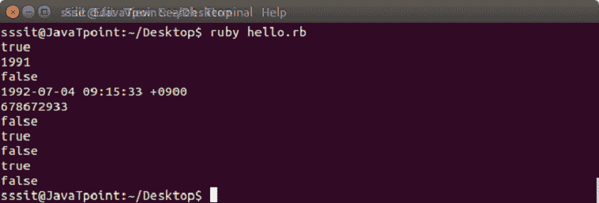
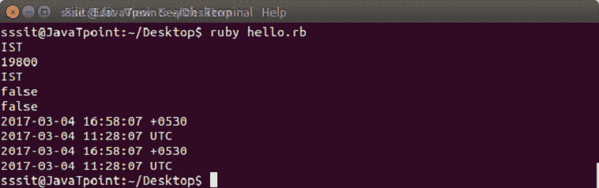

# 红宝石日期和时间

> 原文：<https://www.javatpoint.com/ruby-date-and-time>

Ruby 的文档中主要有三个与日期和时间相关的类。

*   日期
*   日期时间
*   时间

* * *

## 日期

Ruby date 提供了两个类，日期和日期时间。

要理解日期的概念，首先我们需要理解一些术语。

*   **日历日期:**日历日期是一年中某个日历月内的某一天。
*   **序数日期:**序数日期是日历年中由序数标识的特定日期。
*   **周日期:**周日期是由日历周和日数字标识的一天。一年中的第一个日历周包括该年的第一个星期四。
*   **儒略日数:**儒略日数以公元前 4713 年 1 月 1 日中午起经过的日子为单位。
*   **修改后的儒略日数:**修改后的儒略日数以公元 1858 年 11 月 17 日午夜以来经过的天数为单位。

Date 对象是用::new:::parse:::today:、jd:、strptime 等创建的。所有日期对象都是不可变的，因此它们不能修改自己。

**示例:**

```

require 'date' 

puts Date.new(2017,4,3)          
puts Date.jd(2451877)             
puts Date.ordinal(2017,3)       
puts Date.commercial(2017,5,6)   
puts Date.parse('2017-02-03')  
puts Date.strptime('03-02-2017', '%d-%m-%Y')                         
puts Time.new(2017,10,8).to_date   

```

输出:



日期对象有各种方法，如下例所示。

**示例:**

```

require 'date' 

d = Date.parse('4th Mar 2017') 

puts d.year                      
puts d.mon                       
puts d.mday                      
puts  d.wday                      
puts d += 1                      
puts d.strftime('%a %d %b %Y')  

```

输出:



* * *

## 日期时间

Ruby DateTime 是日期的一个子类。它可以轻松处理日期、小时、分钟、秒和偏移量。

用 DateTime.new、DateTime .序数、DateTime.parse、DateTime.jd、DateTime.commercial、DateTime.now 等创建的 DateTime 对象。

**示例:**

```

require 'date' 

puts DateTime.new(2017,3,4,5,6,7) 

```

输出:



日、分、秒或小时的最后一个元素可以是小数。

DateTime 对象有各种方法，如下例所示。

**示例:**

```

require 'date' 

d = DateTime.parse('4th Mar 2017 02:37:05+05:40') 

puts d.hour               
puts d.min               
puts d.sec                
puts d.offset             
puts d.zone               
puts d += Rational('1.0') 

puts d = d.new_offset('+05:00') 

puts d.strftime('%I:%M:%S %p') 

puts d > DateTime.new(2000) 

```

输出:



* * *

## 时间

时间类是日期和时间的抽象。它在内部存储为自纪元以来的秒数。时间类将格林尼治标准时间(格列维奇平均时间)和世界协调时(协调世界时)等同对待。

时间可能看起来是相等的，但相比之下，它们可能是不同的，因为所有时间都可能有分数。

时间实现使用带符号的 63 位整数 Bignum 或 Rational。使用整数时，时间会变慢。

* * *

## 创建新的时间实例

可以用**:新的**创建一个新的时间实例。这将使用您当前系统的时间。年、月、日、小时、分钟等部分时间也可以过去。

创建新的时间实例时，您需要至少经过一年。如果仅过去一年，则时间将默认为该年的 1 月 1 日 00:00:00，使用当前系统时区。

**示例:**

```

puts Time.new        
puts Time.new(2017, 3)     
puts Time.new(2017, 3, 4) 
puts Time.new(2017, 3, 4, 6, 5, 5, "+05:00") 

```

输出:



* * *

## gm、utc 和当地职能部门的时间

除了使用当前系统设置，您还可以使用格林尼治时间、当地时间和世界协调时时区。

**示例:**

```

puts Time.local(2017, 2, 5)  

puts Time.local(2017, 2, 5, 4, 30)   

puts Time.utc(2017, 2, 5, 4, 30)  

puts Time.gm(2017, 2, 5, 4, 30, 36)  

```

输出:



* * *

## 使用时间实例

创建时间实例后，我们可以通过以下方式处理该时间。

**示例:**

```

t = Time.new(1991, 07, 5, 9, 15, 33, "+09:00") 
puts t.friday? #=> false 
puts t.year #=> 1993 
puts t.dst? #=> false 
puts t + (60*60*24*365) #=> 1994-02-24 12:00:00 +0900 
puts t.to_i #=> 730522800 

t1 = Time.new(2017) 
t2 = Time.new(2015) 

puts t1 == t2 #=> false 
puts t1 == t1 #=> true 
puts t1 <  t2 #=> true 
puts t1 >  t2 #=> false 

puts Time.new(2010,10,31).between?(t1, t2) #=> true

```

输出:



* * *

## 时区和夏令时

时间对象可用于获取与时区相关的所有信息。所有信息将根据我们系统的当前时间显示。

**示例:**

```

time = Time.new 

puts time.zone       
puts time.utc_offset 
puts time.zone      
puts time.isdst     
puts time.utc?    
puts time.localtime  
puts time.gmtime    
puts time.getlocal  
puts time.getutc 

```

输出:



* * *