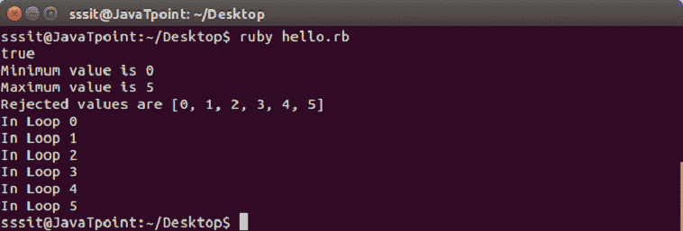

# Ruby范围

> 原文：<https://www.javatpoint.com/ruby-ranges>

Ruby range 表示一组有开始和结束的值。它们可以使用 **s 构建..e** 和 **s...e** 文字或搭配**:新增**。

具有的范围..在它们中，从始至终都包含在内。具有的范围...在它们中，只运行最终值。

```

puts (-5..-1).to_a     
puts (-5...-1).to_a     
puts ('a'..'e').to_a    
puts ('a'...'e').to_a   

```

输出:


Ruby 有多种方法来定义范围。

*   作为序列的范围
*   范围作为条件
*   区间范围

* * *

## 作为序列的范围

定义范围最自然的方法是按顺序。它们有起点和终点。它们是使用以下两种方法之一创建的..或者...操作员。

我们采集的样本范围从 0 到 5。在此范围内执行以下操作。

**示例:**

```

#!/usr/bin/ruby 

range = 0..5 

puts range.include?(3) 
ans = range.min 
puts "Minimum value is #{ans}" 

ans = range.max 
puts "Maximum value is #{ans}" 

ans = range.reject {|i| i < 5 } 
puts "Rejected values are #{ans}" 

range.each do |digit| 
   puts "In Loop #{digit}" 
end

```

输出:



* * *

## 范围作为条件

范围也被定义为条件表达式。在一组行中定义了不同的条件。这些条件包含在开始语句和结束语句中。

**示例:**

```

#!/usr/bin/ruby 
budget = 50000 

watch = case budget 
   when 100..1000 then "Local" 
   when 1000..10000 then "Titan" 
   when 5000..30000 then "Fossil" 
   when 30000..100000 then "Rolex" 
   else "No stock" 
end 

puts watch 

```

输出:


* * *

## 区间范围

范围也可以用区间来定义。区间由 **===** 大小写相等运算符表示。

**示例:**

```

#!/usr/bin/ruby 
if (('a'..'z') === 'v') 
  puts "v lies in the above range" 
end 

if (('50'..'90') === 99) 
  puts "z lies in the above range" 
end

```

输出:


* * *

## Ruby反向范围

Ruby 反向范围运算符不返回值。如果左侧值大于右侧值，则不会返回任何值。

**示例:**

```

#!/usr/bin/ruby 
    puts (5..1).to_a 

```

在上述示例的输出中，不会返回任何内容。

要打印反向订单，您可以在正常范围内使用反向方法，如下所示。

**示例:**

```

#!/usr/bin/ruby 
    puts (1..5).to_a.reverse 

```

输出:


* * *