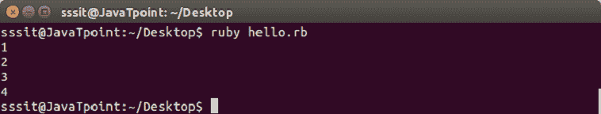
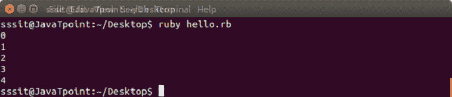
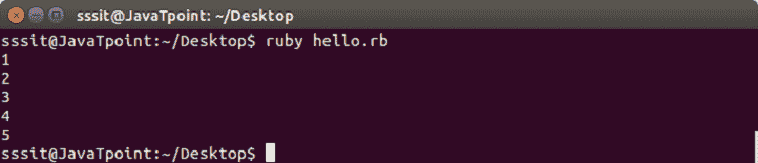
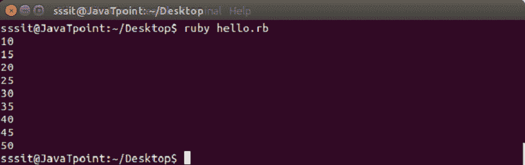
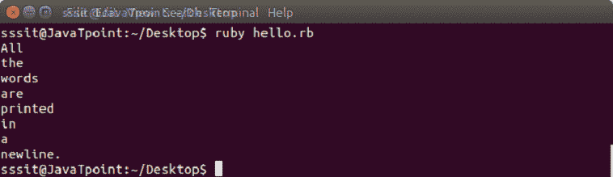

# ruby 迭代器

> 原文：<https://www.javatpoint.com/ruby-iterators>

迭代器是面向对象语言中使用的一个概念。迭代意味着像循环一样多次做一件事。

循环方法是最简单的迭代器。它们一个接一个地返回集合中的所有元素。数组和散列属于集合的范畴。

* * *

## Ruby 每个迭代器

Ruby 每个迭代器从一个散列或数组中返回所有元素。

**语法:**

```
(collection).each do |variable|
  code...
end

```

这里的集合可以是任何数组、范围或散列。

**示例:**

```
#!/usr/bin/ruby 
(1...5).each do |i| 
   puts i 
end 

```

输出:



* * *

## Ruby 时代迭代器

循环由次数迭代器执行指定的次数。循环将从零开始，直到比指定数字少一个。

**语法:**

```
x.times do |variable|
  code...
end

```

这里，在 x 的位置，我们需要定义数字来迭代循环。

**示例:**

```
#!/usr/bin/ruby 
5.times do |n| 
  puts n 
end 

```

输出:



* * *

## Ruby Upto 和 Downto 迭代器

up 迭代器从数字 x 迭代到数字 y。

**语法:**

```
x.upto(y) do |variable|
  code
end

```

**示例:**

```
#!/usr/bin/ruby 
1.upto(5) do |n| 
  puts n 
end

```

输出:



* * *

## Ruby 步长迭代器

步骤迭代器用于在跳过一个范围时进行迭代。

**语法:**

```
(controller).step(x) do |variable|
  code
end

```

这里，x 是迭代过程中将被跳过的范围。

**示例:**

```
#!/usr/bin/ruby 
(10..50).step(5) do |n| 
  puts n 
end

```

输出:



* * *

## Ruby 每行迭代器

每行迭代器用于迭代字符串中的新行。

**示例:**

```
#!/usr/bin/ruby 
"All\nthe\nwords\nare\nprinted\nin\na\nnew\line.".each_line do |line| 
puts line 
end

```

输出:



* * *