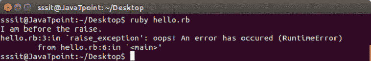
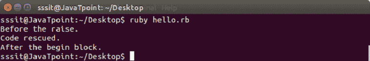
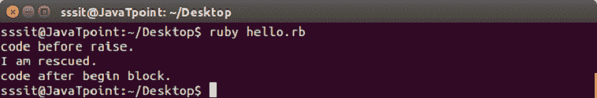
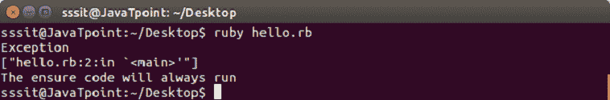
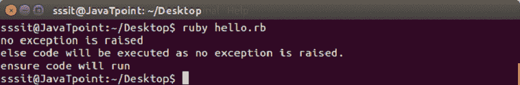
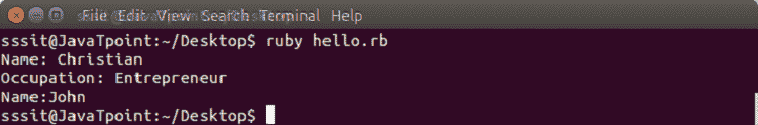

# 红宝石异常

> 原文：<https://www.javatpoint.com/ruby-exceptions>

Ruby exception 是一个对象，是 exception 类的一个实例或该类的后代。它代表一些特殊情况。

在 Ruby 程序中，当出现问题时，它会抛出一个异常行为。默认情况下，Ruby 程序在抛出异常时终止。

我们可以在 Ruby 中声明一些异常处理程序。异常处理程序是一个代码块，当某个其他代码块发生异常时执行。

异常有两种处理方式。你可以终止程序或者处理异常。为了处理一个例外，你可以提供一个救助条款。通过提供这一点，程序控制流向救援条款。

当异常被引发但未被处理时，全局变量 **$！**包含当前异常， **[【邮件保护】](/cdn-cgi/l/email-protection)** 包含当前异常的回溯。

Ruby 预定义的类，如 Exception 及其子类，可以帮助您处理程序中的错误。在 Ruby 异常层次结构中，大多数子类都扩展了 class StandardError。这些都是正常的例外。

* * *

## 红宝石类异常

异常的内置子类如下:

*   NoMemoryError
*   脚本错误
*   安全错误
*   信号异常
*   标准误差
*   系统信息
*   系统跟踪错误
*   致命——无法拯救

**示例:**

```
def raise_exception   
  puts 'I am before the raise.'   
  raise 'oops! An error has occured'   
  puts 'I am after the raise'   
end   
raise_exception  

```

输出:



提升方法来自内核模块。

* * *

## 处理异常

为了处理异常，引发异常的代码被包含在**开始-结束**块中。使用救援条款，我们可以陈述我们想要处理的异常类型。

**示例:**

```
def raise_and_rescue   
  begin   
    puts 'Before the raise.'   
    raise 'An error occured.'   
    puts 'After the raise.'   
  rescue   
    puts 'Code rescued.'   
  end   
  puts 'After the begin block.'   
end   
raise_and_rescue  

```

输出:



在上面的例子中，中断的代码没有完全运行。异常处理后，代码在开始-结束块后继续。

如果救援子句中没有定义参数，则参数默认为标准错误。每个救援条款都指定了多个要捕获的异常。如果在没有任何参数的情况下使用 raise，可能会重新引发异常。

救助条款写在开始/救助块中。如果一个救援条款没有处理例外情况，下一个救援条款将处理例外情况。

```
	begin
code..
rescue OneTypeOfException
code..
rescue AnotherTypeOfException
 code..
else
  # Other exceptions
end

```

在 begin 块中，带有引发异常的每个 rescue 子句将依次与每个参数进行比较。当抛出的错误类型和 rescue 子句中命名的异常类型相同或者是该异常的超类时，它将被匹配。如果 begin 语句体无异常完成，则执行 else 子句。如果出现异常，将不会执行 else 子句。

* * *

## 异常对象

异常对象是正常对象。被拯救的异常可以保留在拯救子句中的变量中。

**示例:**

```
begin 
  raise 'an exception' 
rescue ZeroDivisionError => e 
  puts "Exception Class: #{ e.class.name }" 
  puts "Exception Message: #{ e.message }" 
  puts "Exception Backtrace: #{ e.backtrace }" 
end 

```

**异常**类定义了两种返回异常详细信息的方法。**消息**方法返回一个定义错误解释的字符串。**回溯**方法返回一个字符串数组，该数组表示异常发生时的调用堆栈。

* * *

## 使用重试语句

通常在 rescue 子句中，异常被捕获，代码在 begin 块之后继续。使用 retry 语句，可以在捕获异常后从开始恢复救援块代码。

**语法:**

```
begin
   code....
rescue
    # capture exceptions
    retry  # program will run from the begin block
end

```

**示例:**

```
#!/usr/bin/ruby 

begin 
   x = Dir.mkdir "alreadyExist" 
   if x 
      puts "Directory created" 
   end 
rescue 
   y = "newDir" 
   retry 
end 

```

上述程序运行如下:

**步骤 1** 在开始块中，编写代码来创建一个已经存在的目录。

**第二步**这将抛出一个错误。

**第三步**在救援区块，y 被重新分配。

**步骤 4** 重试语句将转到开始块。

**第 5 步**将创建目录。

* * *

## 使用提升语句

raise 语句用于引发异常。

**语法:**

```
raise 

```

或者，

```
raise "Error Message" 

```

或者，

```
raise ExceptionType, "Error Message"

```

或者，

```
raise ExceptionType, "Error Message" condition

```

第一个会重新引发当前异常。它用于异常处理程序，异常在传递之前被截获。

第二个创建一个新的 RuntimeError 异常。这个异常随后在调用堆栈中被引发。

第三个参数使用第一个参数创建异常，然后将关联的消息设置为第二个参数。

第四个类似于第三个。在这种情况下，您可以添加任何条件语句来引发异常。

**示例:**

```
#!/usr/bin/ruby 

begin   
    puts 'code before raise.'   
    raise 'exception occurred.'   
    puts 'code after raise.'   
rescue   
    puts 'I am rescued.'   
end   
puts 'code after begin block.'  

```

输出:



* * *

## 使用确保语句

有一个**保证**子句，它保证了代码末尾的一些处理。无论是否引发异常，确保块始终运行。它被放在最后一个救援条款之后，并且总是在块终止时执行。

无论异常出现、异常被拯救还是代码被未捕获的异常终止，确保块都会运行。

**语法:**

```
begin 
  code..
   #..raise exception
rescue 
   #.. exception is rescued
ensure 
   #.. This code will always execute.
end

```

**示例:**

```
begin 
  raise 'Exception' 
rescue Exception => e 
  puts e.message 
  puts e.backtrace.inspect 
ensure 
  puts "The ensure code will always run" 
end

```

输出:



* * *

## 使用 else 语句

else 条款总是出现在救援条款之后和保证条款之前。如果没有引发异常，则只执行 else 块。

**语法:**

```
begin 
   code.. 
   #..raise exception
rescue 
   # .. exception is rescued
else
   #.. executes if there is no exception
ensure 
   #..  This code will always execute.
end

```

**示例:**

```
begin 
 # raise 'A test exception.' 
 puts "no exception is raised" 
rescue Exception => e 
  puts e.message 
  puts e.backtrace.inspect 
else 
   puts "else code will be executed as no exception is raised." 
ensure 
  puts "ensure code will run" 
end

```

输出:



* * *

## 红宝石抓抛

Ruby catch 和 throw 提供了一种方法，当代码中不需要进一步的工作时，可以提前从执行中跳转。

catch 定义了一个用给定名称标记的块。它用于跳出嵌套代码。使用 catch，块将正常执行，直到遇到抛出。

抓抛法比救援和加注条款更快。因此，它更适合使用。

**语法:**

```
throw :lablename
#.. this  code will not be executed
catch :lablename do
#.. matching catch will be executed after a throw is encountered.
end

```

或者，

```
throw :lablename condition
#.. this code will not be executed
catch :lablename do
#.. matching catch will be executed after a throw is encountered.
end

```

**示例:**

```
def promptAndGet(prompt) 
   print prompt 
   res = readline.chomp 
   throw :quitRequested if res == "!" 
   return res 
end 

catch :quitRequested do 
   name = promptAndGet("Name: ") 
   age = promptAndGet("Occupation: ") 
   # .. 
   # process information 
end 
promptAndGet("Name:")

```

输出:



* * *