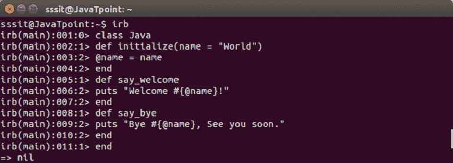
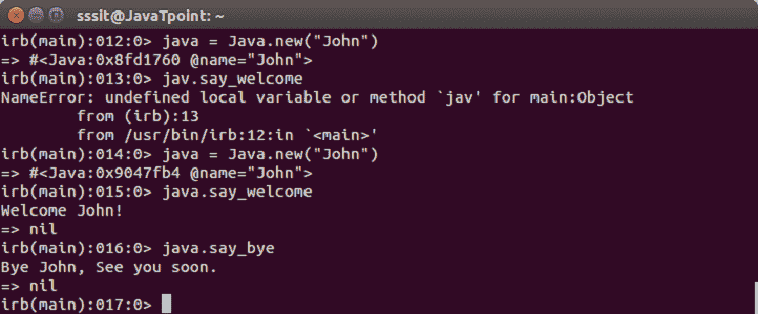
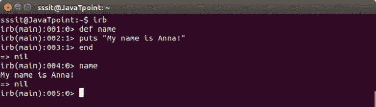
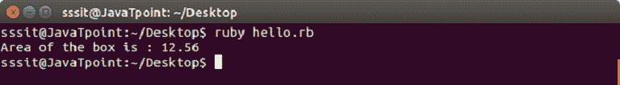
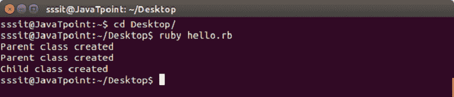
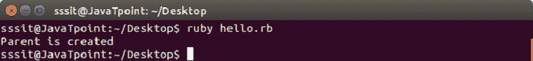

# Ruby OOPs 概念

> 原文：<https://www.javatpoint.com/ruby-oops>

Ruby 是一种真正的面向对象语言，可以嵌入到超文本标记语言中。Ruby 中的一切都是一个对象。所有的数字、字符串甚至类都是一个对象。整个 Ruby 语言基本上建立在对象和数据的概念上。

OOPs 是一个编程概念，它使用对象及其交互来设计应用程序和计算机程序。

以下是 OOPs 中的一些基本概念:

<ulclass>*   包装*   多态性*   遗产*   抽象

**封装:**它对其他对象隐藏了一个类的实现细节，由于这个原因，一个类对代码的其余部分是不可用的。其主要目的是保护数据免受数据操纵。

**多态性:**是针对不同的数据输入，以不同的方式表示一个运算符或函数的能力。

**继承:**它从预定义的类创建新的类。新类继承其父类(被称为超类)的行为。这样，预定义的类可以变得更加可重用和有用。

**抽象:**它通过建模适合问题的类来隐藏类的复杂性。

* * *

## 红宝石类

Ruby 类定义了数据类型的蓝图。它定义了类名的含义。

一个类用一个**类**关键字后跟类名来定义，并以 **end** 关键字结束。

按照惯例，类名必须以大写字母开头。包含多个单词的类名，每个单词都大写，没有分隔字符。

### 创建类

**示例:**

我们将使用以下命令创建一个类 **Java** ，

```
class Greeter

```



创建了一个新的类 **Java** 。@name 是一个实例变量，可用于 Java 类的所有方法。它由 say_welcome 和 say_bye 使用。

* * *

## 红宝石对象

在 Ruby 中，一切都是一个对象。当我们创建对象时，它们通过方法进行通信。因此，对象是数据和方法的组合。

要创建一个对象，首先，我们定义一个类。单个类可以用来创建许多对象。使用 **new** 关键字声明对象。

### 创建对象

**示例:**

我们有一个名为 **Java** 的类。现在，让我们创建一个对象 **java** 并用下面的命令来使用它，

```
java = Java.new("John")

```



一旦创建了 **java** 对象，它将使用约翰作为名称。

* * *

## 红宝石方法

方法是在类的主体中定义的函数。Ruby 中的数据只能通过方法访问。当调用一个方法时，Ruby 会遵循一个路径。要找出方法查找链，我们可以使用**祖先**方法。

### 定义方法

方法用 **def** 关键字定义，以 **end** 关键字结束。

我们正在定义一个方法**名称**，它将显示以下消息。



def 关键字开始定义方法名。然后我们写方法的主体。最后一行结束表示方法已定义。

### 实例方法

实例方法也是用 def 关键字定义的，它们只能使用类实例。

**示例:**

```
#!/usr/bin/ruby -w 

# define a class 
class Circle 
   # constructor method 
   def initialize(r) 
      @radius = r 
   end 
   # instance method 
   def getArea 
      3.14 * @radius * @radius 
   end 
end 

# create an object 
circle = Circle.new(2) 

# call instance methods 
a = circle.getArea() 
puts "Area of the box is : #{a}"

```

输出:



* * *

## 红宝石继承

在继承中，我们使用预定义的类创建新的类。新创建的类称为派生类，派生它们的类称为基类。通过继承，代码可以被再次重用，这降低了程序的复杂性。

Ruby 不支持多级继承。相反，它支持**混合。**

在 Ruby 中， **<** 字符用于创建子类。语法如下所示:

```
parentClass < subClass

```

**示例:**

```
#!/usr/bin/ruby 

class Parent 

    def initialize 
        puts "Parent class created" 
    end 
end 

class Child < Parent 

   def initialize 
       super 
       puts "Child class created" 
   end 
end 

Parent.new 
Child.new

```

在上面的例子中，创建了两个类。一个是基**父**类，另一个是派生**子**类。

**超**方法调用父类的构造函数。

从最后两行，我们实例化了这两个类。

输出:



在输出中，首先创建父类，派生的子类也调用其父类的构造函数，然后创建子类。

* * *

## Ruby 构造函数

创建对象时会自动调用构造函数。它们不返回值。在 Ruby 中，它们被称为**初始化。**

构造函数的主要目的是初始化对象的状态。它们不能被遗传。父对象构造函数是用超级方法调用的。

**示例:**

```
#!/usr/bin/ruby 

class Parent 

    def initialize 
        puts "Parent is created" 
    end 

end 

Parent.new 

```

输出:



* * *</ulclass>