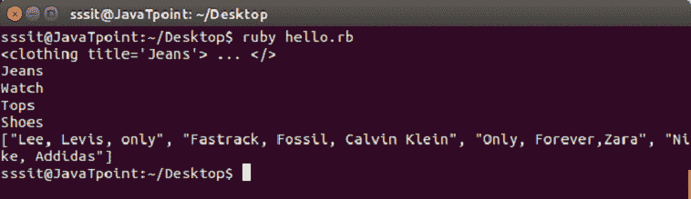

# Ruby XPath 和 XSLT

> 原文：<https://www.javatpoint.com/ruby-xpath-and-xslt>

* * *

## Ruby XPath

Ruby XPath 是一种在 XML 文件中查找信息的语言。它是查看 XML 文件的替代方法。它用于浏览 XML 文档中的元素和属性，将该文档视为逻辑有序树。

Ruby XPath 对于从 XML 文件中获取相关信息和属性非常有用。它需要基于树的解析。

**示例:**

```
#!/usr/bin/ruby -w 

require 'rexml/document' 
include REXML 

xmlfile = File.new("trial.xml") 
xmldoc = Document.new(xmlfile) 

# Info for the first cloth found 
clothing = XPath.first(xmldoc, "//clothing") 
p clothing 

# Print out all the cloth types 
XPath.each(xmldoc, "//type") { |e| puts e.text } 

# Get an array of all of the cloth brands. 
names = XPath.match(xmldoc, "//brand").map {|x| x.text } 
p names

```

输出:



* * *

## Ruby XSLT

Ruby XSLT 是一个基于 libxml 和 libxslt 的简单类。Ruby 有两个 XSLT 解析器。

*   鲁比·赛博伦
*   XSLT4R

它可以根据 GNU 的条款自由分配。这个程序是免费分发的。

**Ruby组合源**

主要是为 Linux 操作系统写的，由高桥正义写的。

它需要以下库:

*   sablog
*   Iconv
*   亡命国外者

**XSLT4R**

这是迈克尔·诺依曼写的。它使用简单的命令行界面，也可以在第三方应用程序中用来转换 XML 文档。

XSLT4R 需要 XMLScan 才能运行，这包含在 XSLT4R 架构中。这些模块需要使用标准的 Ruby 安装方法来安装。

语法:

```
ruby xslt.rb stylesheet.xsl document.xml [arguments]

```

要在应用程序中使用 XSLT4R，您需要包含 XSLT 并输入您需要的参数。

* * *