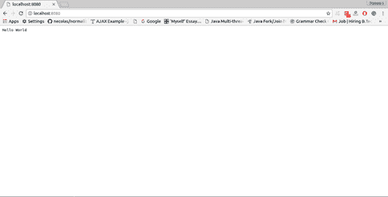

# 转到 HTTP 服务器

> 原文：<https://www.javatpoint.com/go-http-server>

Go 也可以用来创建 web 应用程序。Net/http 是一个用于构建 web 应用程序的库包。它有 HandelFunc()函数，该函数将传入的请求路由到相应的函数。ListenAndServe 函数用于创建一个监听所提供端口的资源服务器。函数 someFunc 有 http。ResponceWriter 和 http。请求类型参数。它负责接收传入的请求，并在处理返回响应后。

**转 http 服务器示例**

```

package main
import (
   "fmt"
   "net/http"
)
func main() {
   http.HandleFunc("/",MyHandler1)
   http.HandleFunc("/John",MyHandler2)
   http.ListenAndServe(":8080",nil)
}
func MyHandler1(w http.ResponseWriter,r *http.Request){
   fmt.Fprint(w,"Hello World\n")
}
func MyHandler2(w http.ResponseWriter,r *http.Request){
   fmt.Fprint(w,"Hello John\n")
}

```

输出:

