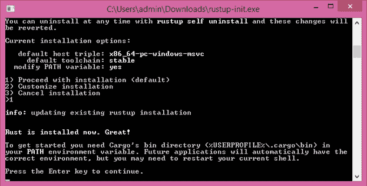
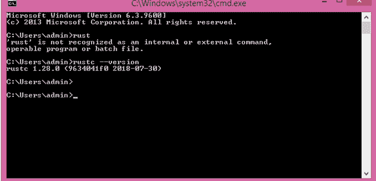

# Rust安装

> 原文：<https://www.javatpoint.com/rust-installation>

第一步是安装 Rust。首先通过 **rustup** 下载 Rust，rustup 是管理所有 Rust 版本及其相关工具的命令行工具。

## 窗户Rust安装

*   在 Windows 上，打开链接[https://www.rust-lang.org/install.html](https://www.rust-lang.org/install.html)，按照说明安装 Rust。遵循所有说明后，将安装 Rust 并出现屏幕:



*   安装后，Rust 的路径变量会自动添加到您的系统路径中。
*   打开命令提示符，然后运行以下命令:

```

	$ rustc --version 

```

运行此命令后，您应该会看到版本号、提交哈希和提交日期。

如果你这样做了，这意味着 Rust 已经成功安装。恭喜你！！！



### 注意:运行 rust 程序必须安装带有 C++ 工具的 visual studio。

## Linux 或 macOS 中的 Rust 安装

如果您使用的是 Linux 或 macOS，请打开终端，然后使用以下命令:

```

 $ curl https://sh.rustup.rs -sSf | sh 

```

*   上面的命令下载一个脚本并开始安装 rustup 工具。这将安装最新版本的 Rust。如果安装成功，将出现以下消息:

```

	Rust is installed now. Great!

```

*   此安装会在您下次登录后自动将 Rust 添加到您的系统路径中。如果您想在不重启终端的情况下立即运行 Rust，那么请在 shell 中运行以下命令，手动添加系统路径:

```

   $ source $HOME/.cargo/env

```

安装后，您需要一个链接器。当你试图运行你的 Rust 程序时，你会得到一个链接器无法执行的错误。这意味着链接器没有安装在您的系统中。c 编译器总是能找到正确的编译器。安装一个 C 编译器。此外，一些 Rust 包依赖于 C 代码，需要一个 C 编译器。

## 更新和卸载

**更新:**你通过**【rustup】**安装好你的 Rust 后，更新到最新版本。运行以下命令更新到最新版本:

```

 $ rustup update

```

**卸载:**如果你想卸载你的 Rust，那么从外壳运行以下命令:

```

 $ rustup self uninstall

```

* * *