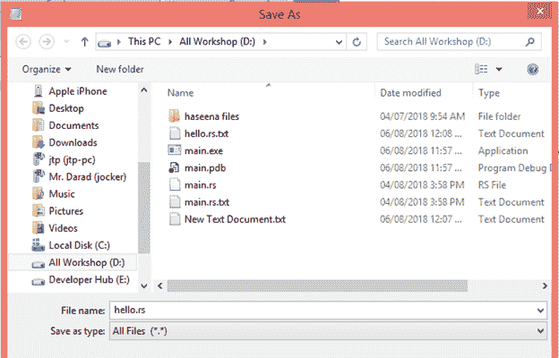
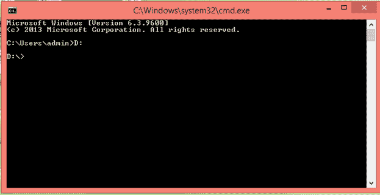
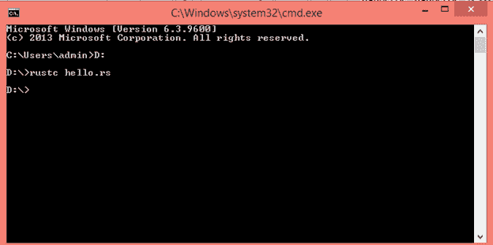
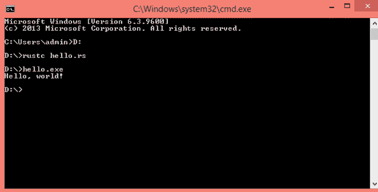

# 第一个铁锈计划

> 原文：<https://www.javatpoint.com/first-rust-program>

让我们用 Rust 语言编写简单的程序。现在，打开记事本文件并编写以下代码:

```

 fn main()
{
     println!("Hello, world!");
}

```

**输出:**

```
Hello, world!

```

**main():**main()函数始终是每个 Rust 可执行代码中的第一个代码。main()函数用花括号{}括起来。main()函数不包含任何参数，也不返回值。

**println！:**是一个 Rust 宏。如果它调用函数，那么它不包含“！”。

**“Hello World”:**是作为参数传递给 println 的字符串！，字符串将打印到控制台。

## 创建、编译和运行程序的过程

1.打开记事本文件，将代码写在记事本文件中。

2.用*保存文件。rs* 分机。



3.打开命令提示符

4.设置目录的路径。假设项目位于 D 驱动器。



5.使用 rustc 命令编译上述程序。



6.最后，使用命令**filename.exe**运行程序。



* * *