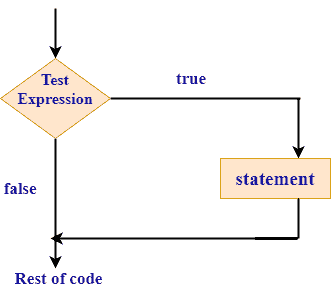
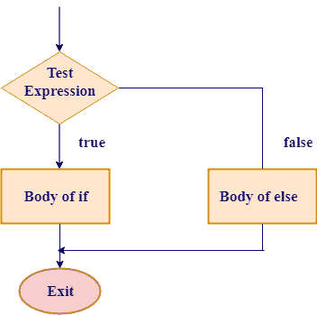
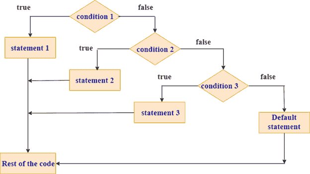

# ' If '语句

> 原文：<https://www.javatpoint.com/rust-if-statement>

“if”语句确定条件是否为真。如果条件为真，则执行“如果”块，否则，控制跳过“如果”块。

**表示‘if’块的不同方式:**

*   if 块
*   if-else 块
*   如果其他-如果梯子
*   嵌套 if

## “if”的语法:

```

if condition
 {
             //block statements;
}

```

在上面的语法中，如果条件为真，则执行块语句，否则跳过块。

**“if 语句”流程图**



## 例如:

**我们来看一个‘if’语句的简单例子。**

```

 fn main()
{
  let a=1;
  if a==1
   {
       println!("a is equal to 1");
    }
}

```

**输出:**

```
a is equal to 1

```

在本例中， **a** 的值等于 1。因此，**“if”**中给出的条件为真，字符串作为参数传递给 println！显示在控制台上。

* * *

## “如果-否则”

如果条件为真，则执行“If”块，并跳过“else”块中的语句。如果条件为假，则执行“else”块，并跳过“If”块中的语句。

## “if-else”的语法

```

 if condition
{
   //block statements
}
else
{
    //block statements
 }

```

**如果-否则流程图**



**我们来看一个‘if-else’语句的简单例子。**

```

 fn main()
{
  let a=3;
  let b=4;
  if a>b
  {
     println!("a is greater than b");
  }
  else
   {
     println!("a is smaller than b"); 
   }
}

```

**输出:**

```
a is smaller than b

```

在本例中，a 的值等于 3，a 的值小于 b 的值。因此，执行 else 块，并在屏幕上打印“a 小于 b”。

* * *

## 否则-如果

当您想要检查多个条件时，则使用' else-if '语句。

## else-if 的语法

```

 if condition 1
{
  //block statements
}
else if condition 2
{
  //block statements
} 
.
.
else{
//block statements
}

```

在上面的语法中，Rust 为第一个真实条件执行块，一旦它找到第一个真实条件，它就不会执行其余的块。

**“否则如果”**流程图



**我们来看一个 else-if 语句的简单例子**

```

 fn main()
{
  let num= -5;
  if num>0
  {
    println!("number is greater than 0");
  }
  else if num<0
  {
    println!("number is less than 0 ");
  }
  else
  {
    println!("number is not equal to 0");
  }

}

```

**输出:**

```
number is less than 0

```

在本例中，num 的值等于-5，num 小于 0。因此，否则如果块被执行。

* * *

## 嵌套 if-else

当一个 if-else 语句出现在另一个 if 或 else 块的主体中时，它被称为嵌套 if-else。

## 嵌套 if-else 的语法

```

 if condition 1
{
   // block statements
   if condition 2
{
      //block statements
}
else
{
    //block statements
}
}
else
{
   //block statements
}

```

**我们来看一个嵌套 if-else 的简单例子**

```

 fn main()
{
  let a=5;
  let b=6;
  if a!=b
  {
    if a>b
    {
      println!("a is greater than b");
    }
    else
     {
       println!("a is less than b");
     }
  }

  else
 {
       println!("a is equal to b");
  }
}

```

**输出:**

```
a is less than b

```

在本例中，a 的值不等于 b。因此，控制进入“if”块内部，a 的值小于 b。因此，执行“else”块，该块位于“if”块内部。

* * *