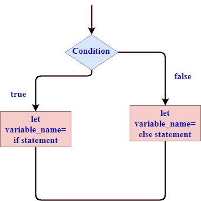

# 使用“如果在信中”语句

> 原文：<https://www.javatpoint.com/rust-if-in-a-let-statement>

在 let 语句的右侧使用了一个**“if”**表达式，并将**“if”**表达式的值赋给了**“let”**语句。

## “如果在信中”的语法

```

 Let variable_name= if condition{
//code blocks
}  
else{
//code block
}

```

在上面的语法中，如果条件为真，则将“if”表达式的值赋给变量，如果条件为假，则将“else”的值赋给变量。



## 例 1

**我们来看一个简单的例子。**

```

 fn main()
{
  let a=if true
        {
           1
        }
        else
        {
            2
        };

  println!("value of a is: {}", a);
}

```

**输出:**

```
value of a is: 1

```

在这个例子中，条件为真。因此，“a”变量限制了“if”表达式的值。现在，一个由 1 组成的值。

**我们再来看一个简单的例子。**

```

 fn main()
{
  let b=if false
        {
           9
        }
        else
        {
            "javaTpoint"
        };

  println!("value of a is: {}", a);
}

```

**输出:**

```
Some errors occurred:E0308

```

在本例中，“if”块计算为整数值，而“else”块计算为字符串值。因此，这个程序抛出一个错误，因为两个块都包含不同类型的值。

* * *