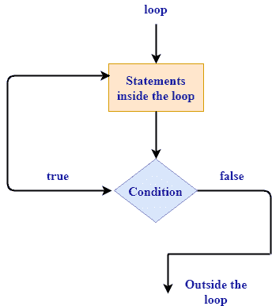

# 环

> 原文：<https://www.javatpoint.com/rust-loop>

如果我们想多次执行语句块，那么 loops 概念就属于这个角色。循环执行循环体中的代码直到结束，并从开始处立即重新开始。

**Rust由三种回路组成:**

*   [循环](rust-loop)
*   [为循环](rust-for-loop)
*   [同时循环](rust-while-loop)

* * *

## 环

该循环不是条件循环。它是一个关键字，告诉 Rust 一次又一次地执行代码块，直到并且除非您显式地手动停止循环。

## 循环语法

```

 loop{
  //block statements
}

```

在上面的语法中，块语句被执行无限次。

**回路流程图:**



**我们来看一个无限循环的简单例子**

```

 fn main()
{
  loop
  {
      println!("Hello javaTpoint");
}}

```

**输出:**

```
Hello javaTpoint
Hello javaTpoint
Hello javaTpoint
Hello javaTpoint
.
.
.
infinite times 

```

在这个例子中，“Hello javaTpoint”被一遍又一遍地打印，直到并且除非我们手动停止循环。通常，“ctrl+c”命令用于终止循环。

## 环路端接

“中断”关键字用于终止循环。如果不使用' break '关键字，那么循环将被执行无限次。

**我们来看一个简单的例子**

```

 fn main()
{
  let mut i=1;
  loop
  {
        println!("Hello javaTpoint");
        if i==7 
        {
          break;
        }
  i+=1;
  }}

```

**输出:**

```
Hello javaTpoint
Hello javaTpoint
Hello javaTpoint
Hello javaTpoint
Hello javaTpoint
Hello javaTpoint
Hello javaTpoint

```

在上面的例子中，I 是一个计数器变量，它是一个可变变量，表示计数器变量可以更改以备将来使用。

* * *