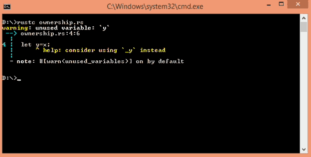
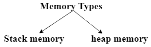
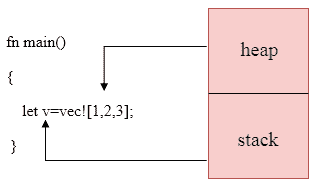
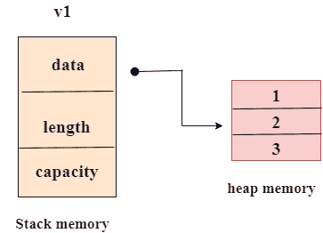
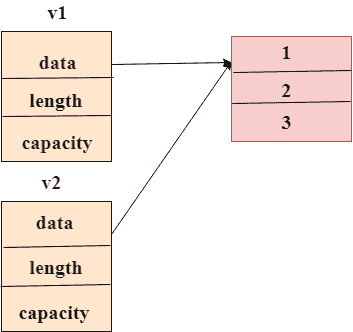
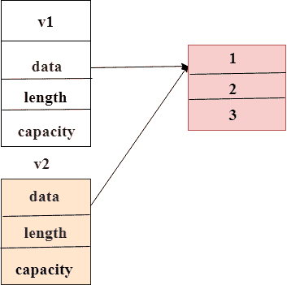

# Rust所有权

> 原文：<https://www.javatpoint.com/rust-ownership>

## 理解所有权

所有权是 Rust 编程语言提供的独特功能，它在不使用垃圾收集器或指针的情况下提供了内存安全的保证。

## 什么是所有权？

当一个代码块拥有一个资源时，它被称为**所有权**。代码块创建一个包含资源的对象。当控件到达块的末尾时，对象被销毁，资源被释放。

## 所有权的要点:

*   “所有者”可以根据可变性改变变量的拥有值。
*   所有权可以转移到另一个变量。
*   所有权只是 Rust 中的移动语义。
*   所有权模式也保证了并行的安全性。

## 所有权规则

*   在 Rust 中，每个值都有一个与之关联的变量，这个变量被称为它的所有者。
*   一次只能有一个所有者。
*   当所有者超出范围时，与之关联的值就会被破坏。

## 所有权示例

在 Rust 中，多个变量可以相互作用。让我们看一个例子:

**将 x 的值赋给变量 y:**

```

 let x=10;
let y=x;

```

在上面的例子中，x 绑定到值 10。然后，将 x 的值赋给变量 y，在这种情况下，不创建 x 的副本，而是将 x 的值移动到变量 y，因此，x 的所有权转移到变量 y，变量 x 被销毁。如果我们试图重用变量 x，那么 Rust 会抛出一个错误。让我们通过一个例子来理解这一点。

```

 fn main()
{
 let x=10;
 let y=x;
 println!("value of x :{}",x);
}

```

**以下是上述示例的输出:**



## 内存和分配

在 Rust 中，数据可以存储在堆栈或堆内存中。



**堆栈内存:**在堆栈内存中，数据总是按顺序放置，按相反的顺序移除。它遵循“后进先出”的原则，即最后插入的数据总是先被移除。堆栈内存是一种有组织的内存。它比堆内存快，因为它访问内存的方式。如果数据的大小在编译时未知，则堆内存用于存储内容。

**堆内存:**堆内存是一种有组织的内存。操作系统在堆内存中找到一个空白空间，并返回一个指针。这个过程被称为“堆上分配”。



该图显示堆栈包含指针，而堆包含内容。

**我们来看一个简单的内存分配的例子。**

```

 fn main()
{
  let v1=vec![1,2,3];
  let v2=v1;
}

```

## 第一步:

在程序的第一条语句中，向量 v1 与值 1、2 和 3 绑定。向量由三部分组成，即指向内存的指针，指向内存中存储的数据，向量的长度和容量。这些部分存储在堆栈中，而数据存储在堆内存中，如下所示:



## 第二步:

在程序的第二个语句中，向量 v1 被赋给向量 v2。指针、长度和容量被复制到堆栈上，但是我们不复制堆内存中的数据。让我们看看记忆的表现:



然而，这种类型的表示会产生问题。当 v1 和 v2 都超出范围时，两者都会尝试释放内存。这导致双重自由内存，这导致内存损坏。

## 第三步:

Rust 避免了步骤 2 的条件，以确保内存安全。Rust 没有复制分配的内存，而是认为 v1 向量不再有效。因此，当 v1 超出范围时，它不需要释放 v1 的内存。



## 复制特性的使用

Copy trait 是一个特殊的注释，它被放在像存储在堆栈上的整数这样的类型上。如果在类型上使用了复制特性，那么即使在赋值操作之后，也可以进一步使用较旧的变量。

以下是一些复制类型:

*   所有的整数类型，如 u32。
*   布尔类型，布尔值为真或假。
*   所有的浮动类型，如 f64。
*   字符类型，字符。

## 所有权和职能

当变量被传递给函数时，所有权转移到被调用函数的变量。传递值的语义等于给变量赋值。

**我们通过一个例子来了解一下:**

```

 fn main()
{
  let s=String::from("javaTpoint");
  take_ownership(s);
  let ch='a';
  moves_copy(ch);
  println!("{}",ch);
}
fn take_ownership(str:String)
{
 println!("{}",str);
}
fn moves_copy(c:char)
{
  println!("{}",c);
}

```

**输出:**

```
javaTpoint
a
a

```

在上面的例子中，字符串与值“javaTpoint”绑定，并且变量的所有权通过 take _ Overty()函数传递给变量“str”。“ch”变量与值“a”绑定，“ch”变量的所有权通过 moves_copy()函数传递给变量“c”。“ch”变量也可以在后面使用，因为这个变量的类型是“复制”特征。

## 返回值和范围

从函数中返回值也会转移所有权。**我们来看看这个:**

```

 fn main()
{
  let x= gives_ownership();
  println!("value of x is {}",x);
 }
fn gives_ownership()->u32
{
     let y=100;
     y
}

```

**输出:**

```
value of x is 100

```

在上面的例子中，赋予 _ 所有权()函数返回 y 的值，即 100，y 变量的所有权转移到 x 变量。

* * *