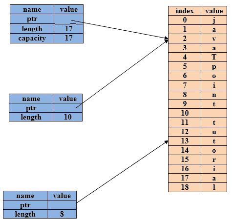

# 什么是切片？

> 原文：<https://www.javatpoint.com/rust-slices>

切片是一种没有所有权的数据类型。切片引用连续的内存分配，而不是整个集合。它允许在不复制的情况下安全、高效地访问阵列。切片不是直接创建的，而是从现有变量创建的。切片由长度组成，它可以是可变的，也可以不是可变的。切片仅表现为数组。

## 字符串切片

字符串片段是指字符串的一部分。切片看起来像:

```

 let str=String::from("javaTpoint tutorial");
let javaTpoint=&str[0..10];
let tutorial=&str[11,18];

```

我们想取字符串的一部分，而不是取整个字符串。开始..end]语法是从开头开始但不包括结尾的范围。因此，我们可以通过在方括号内指定范围来创建切片，如[start..end]其中“start”指定元素的起始位置,“end”比切片中的最后一个位置多一个。如果我们想包含字符串的结尾，那么我们必须使用..= '而不是'..'。

```

 let str= String::from("javaTpoint tutorial");
let javaTpoint = &str[0..=9];
let tutorial= &str[11..=18] ;

```

**图解表示:**



*   如果您想从 0 开始索引，那么我们也可以删除开始索引。看起来像是:

```

 let str= String::from("hello world");
let hello = &str[0..5];
let hello=&str[..5];

```

*   如果 slice 包含字符串的最后一个字节，那么我们可以删除起始索引。看起来像是:

```

 let str= String::from("hello world") ;
let hello=&str[6..len];
let world = &str[6..];

```

**我们来看一个简单的字符串切片的例子:**

```

 fn main() 
{
 let str=String::from("javaTpoint tutorial");
 let javatpoint=&str[..=9];
 println!("first word of the given string is {}",javatpoint);
}

```

**输出:**

```
first word of the given string is javaTpoint

```

## 字符串切片是文字

字符串文字以二进制存储，并且字符串文字仅被视为字符串片段。让我们看看:

```

 let str = "Hello javaTpoint" ;

```

“str”的类型是“&str”。它是指向二进制文件特定点的切片。字符串文字是不可变的，而“&str”是不可变的引用。

## 字符串切片作为参数

如果我们有一个字符串切片，那么我们可以直接传递它。我们不是传递引用，而是将字符串片段作为参数传递给函数，以使应用编程接口更加通用和有用，而不会失去其功能。

```

 fn main()
{
 let str= String:: from("Computer Science");
let first_word=  first_word(&str[..]); //first_word function finds the first word of the string.
let s="Computer Science" ; //string literal
let first_word=first_word(&s[..]); // first_word function finds the first word of the string.
let first_word=first_word(s) ; //string slice is same as string literal. Therefore, it can also be     
                                                  written in this way also.                           
}

```

## 其他切片

数组也可以被视为切片。它们的行为类似于字符串切片。切片的类型为[&i32]。通过将引用存储为第一个元素，将长度存储为第二个元素，它们的工作方式类似于字符串切片。

**考虑一个数组:**

```

 let arr = [100,200,300,400,500];  // array initialization
let a = &arr[1..=3]; // retrieving second,third and fourth element

```

**我们来看一个简单的例子。**

```

 fn main()
{
 let arr = [100,200,300,400,500,600];
 let mut i=0;
 let a=&arr[1..=3];
 let len=a.len();
 println!("Elements of 'a' array:");
 while i<len
 {
  println!("{}",a[i]);
  i=i+1;
 }
 }

```

**输出:**

```
Elements of 'a' array:
200
300
400

```

* * *