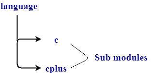

# 生锈模块

> 原文：<https://www.javatpoint.com/rust-modules>

模块是包含函数或其类型定义的命名空间。模块是诸如函数、结构、特征、impl 块等项目的集合。默认情况下，模块的修饰符是私有的，但是可以通过使用 pub 关键字用公共修饰符覆盖它。

**以下是模块中使用的关键词:**

*   **mod 关键字:**mod 关键字声明新模块。
*   **pub 关键字:**默认情况下，所有函数、类型、模块和常量都有一个私有的可见性修饰符。pub 关键字使可见性修饰符成为公共的，因此，它们可以在命名空间之外访问。
*   **use 关键字:**use 关键字用于将模块导入本地范围。

## 模块定义

该模块由 mod 关键字定义。

**模块的语法:**

```

 mod module_name
{
   // body inside the module. 
} 

```

**模块可以通过三种方式进行分类:**

**1。单个模块:**当模块出现在单个文件中时称为单个模块。

**我们通过一个例子来了解一下:**

```

 mod a
{
 pub fn single_module()
{
  println!("Single module");
}
}
fn main()
{
  a::single_module();
}

```

**输出:**

```
Single module

```

在上面的例子中，定义了模块“a”，并且在块中定义的每个代码都在命名空间“a”中。模块“a”的函数可以通过使用模块名后跟命名空间，然后是函数名来调用。

*   我们也可以通过使用单独的文件来完成上面的示例:

```

 mod module;
fn main()
{
  module::single_module();
}

```

```

pub fn single_module()
{
	println!("Single module");
}

```

**输出:**

```
Single module

```

在上面的两个例子中，我们检查了 ***mod X 是在花括号*** 中定义的，还是在名为 X.rs 或 X/mod.rs 的单独文件中定义的。

**2。子模块:**在一个文件中，我们可以有多个模块。假设库名为“语言”，它由两个模块组成，即 C 和 Cplus。

**下面给出了“语言”库的层次结构:**



**我们通过一个例子来了解一下:**

```

 mod c
{
  pub fn c()
  {
    println!("C is a structured programming language");
  }
}
mod cplus
{
 pub fn cplus()
 {
    println!("C++ is an object-oriented programming language");
 }
}
fn main()
{
  c::c();
  cplus::cplus();
}

```

**输出:**

```
C is a structured programming language
C++ is an object-oriented programming language

```

在上面的例子中，程序由两个模块组成，即 c 和 cplus，它们各自的函数是使用 c::c()和 cplus::cplus()调用的。

**3。嵌套模块:**嵌套模块是由模块内部的一个模块组成的模块，当相关模块组合在一起时，它们会很有用。

**我们通过一个例子来了解一下:**

```

 mod a
{
 pub fn a()
 {
   println!("a module");
 }
 pub mod b
 {
   pub fn a()
   {
     println!("b module");
   }
 }
}
fn main()
{
 a::a();
 a::b::b();
}

```

**输出:**

```
a module
b module

```

在上面的例子中，程序由两个模块组成，即‘a’和‘b’，其中‘b’是‘a’的内部模块。这两个模块由同名但功能不同的功能组成。这两个函数分别通过使用 a::a()和 a::b::b()来调用。它们都不会相互冲突，因为它们属于不同的名称空间。

* * *