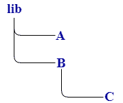

# 文件系统

> 原文：<https://www.javatpoint.com/rust-module-filesystem>

一个模块形成一个层次结构，这样项目变得更容易理解。Rust 模块系统用于拆分多个文件，使得并非所有文件都位于 src/lib.rs 或 src/main.rs 文件中。

**文件名:src/lib.rs**

```

 mod A
{
     fn a()
     {
          // block of statements.
     }
}  
mod B
{
     fn b()
     {
            // block of statements.  
     }
   mod C
  {
       fn c()
       {
             // block of statements.
       }
  }  
} 

```

在上面的例子中，一个程序由三个模块组成，即 A、B 和 C。C 是 B 模块的内部模块。

**给定文件的模块层次为:**



如果模块包含许多函数，并且函数非常长，那么就很难找到特定函数的代码。Rust 通过提供模块系统提供了灵活性。我们可以为每个模块创建一个单独的文件，而不是放在同一个文件中，即 src/lib.rs。

## 应遵循的步骤:

首先，用分号替换模块“A”的块。

```

 mod A;
mod B
{
     fn b()
     {
            // block of statements.  
     }
   mod C
  {
       fn c()
       {
             // block of statements.
       }
  }  
} 

```

分号；告诉 Rust 在另一个定义模块“A”范围的位置找到模块“A”的定义。

*   **mod A；看起来像:**

```

  mod A
{
     fn a()
     {
          // block of statements.
     }
}  

```

现在创建包含模块 A 定义的外部文件。外部文件的名称将被命名为 src/A.rs。创建文件后，将模块 A 的定义写入先前已删除的文件中。

**文件名:src/a . RS**

```

      fn a()
     {
          // block of statements.
     }

```

在这种情况下，我们不需要编写我们在 src/lib.rs 文件中提到的 mod 声明。并且，如果我们在这里写 mod 声明，那么它就变成了模块 a 的子模块。

Rust 默认情况下会查看 src/lib.rs 文件，然后该文件会确定要进一步查看哪个文件。

现在，我们将从文件 src/lib.rs 中提取模块 B，并用分号替换模块 B 的主体。

**文件名:src/lib.rs**

```

 mod A;
mod B; 

```

*   **mod B；看起来像:**

```

 mod B
{
     fn b()
     {
            // block of statements.  
     }
   mod C
  {
       fn c()
       {
             // block of statements.
       }
  }  
} 

```

现在创建包含模块 B 定义的外部文件。外部文件的名称将被命名为 src/B.rs。创建文件后，将模块 B 的定义写入该文件中，该文件之前已被删除。

**文件名:src/B.rs**

```

 fn b()
     {
            // block of statements.  
     }
   mod C
  {
       fn c()
       {
             // block of statements.
       }
  }  

```

现在我们将从文件 src/B.rs 中提取模块 C，并用分号替换模块 C 的主体。

```

 fn b()
     {
            // block of statements.  
     }
mod C;

```

*   **mod C；看起来像:**

```

    mod C
  {
       fn c()
       {
             // block of statements.
       }
  }  

```

现在创建包含模块 C 定义的外部文件。外部文件的名称将被命名为 src/C.rs。创建文件后，将模块 C 的定义写入先前已删除的文件中。

**文件名:src/C.rs**

```

 fn c()
       {
             // block of statements.
       }

```

#### 注意:从模块 B 中提取模块 C 将导致编译错误，因为 src/B.rs 不同于 src/lib.rs。因此，src/B.rs 将被移动到一个新的目录并重命名为 src/B/mod.rs，然后将子模块移动到新的“B”目录中。

### 模块文件系统的规则:

*   如果模块名为“server”并且没有子模块，那么模块的所有声明都可以放在文件 server.rs 中。
*   如果名为“server”的模块包含子模块，那么该模块的所有声明都将放在文件服务器/mod.rs 中。

* * *