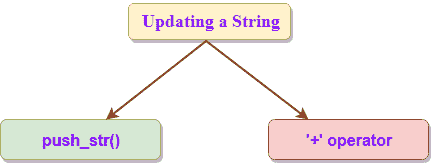

# 线

> 原文：<https://www.javatpoint.com/rust-string>

Rust包含两种类型的弦: **&弦**和**弦**。

## 字符串:

*   字符串被编码为 UTF 8 序列。
*   在堆内存上分配一个字符串。
*   细绳的尺寸可以变大。
*   它不是空终止序列。

## &str

*   “&str”也称为字符串切片。
*   它由&[u8]表示，指向 UTP-8 序列。
*   “&str”用于查看字符串中的数据。
*   它的大小是固定的，即不能调整大小。

## 带“字符串”和“&str”的区别。

*   字符串是可变引用，而&str 是对字符串的不可变引用，也就是说，我们可以更改字符串的数据，但不能操作&str 的数据。
*   字符串包含其数据的所有权，而&str 没有所有权，它从另一个变量借用它。

## 创建新字符串

字符串的创建方式与我们创建向量的方式类似。让我们看看这个:

**创建空字符串:**

```

Let mut s = String::new();

```

在上面的声明中，字符串 s 是通过使用 new()函数创建的。现在，如果我们想在声明时初始化字符串，我们可以通过使用 **to_string()** 方法来实现。

*   在数据上实现 to_string()方法:

```

let a = "javaTpoint";
let s = a.to_string();

```

*   我们还可以直接在字符串上实现 to_string 方法:

```

let s = "javaTpoint".to_string();

```

**我们通过一个例子来了解一下:**

```

 fn main()
{
  let data="javaTpoint";
  let s=data.to_string();
  print!("{} ",s);
  let str="tutorial".to_string();
  print!("{}",str);
}

```

**输出:**

```
javaTpoint tutorial

```

*   创建字符串的第二种方法是使用字符串::from 函数，这相当于字符串::new()函数。

**我们通过一个简单的例子来了解一下:**

```

fn main()
    {
          let str = String::from("javaTpoint tutorial");
          print!("{}",str);
    }

```

**输出:**

```
javaTpoint tutorial

```

## 更新字符串

我们可以通过将更多的数据推入字符串来改变字符串的大小和内容。我们还可以使用 format 宏的‘+’运算符！连接字符串值。



*   **用 push_str 追加一个字符串并推送**

**push_str() :** 我们可以使用 push_str()函数来增加 String 的大小。它在字符串的末尾追加内容。假设 s1 和 s2 是两个字符串，我们希望将字符串 s2 附加到字符串 s1 上。

```

s1.push_str(s2);

```

**我们通过一个简单的例子来了解一下:**

```

fn main()
{
  let mut s=String::from("java is a");
  s.push_str(" programming language");
  print!("{}",s);
}

```

**输出:**

```
java is a programming language

```

**push_str()** 函数不拥有参数的所有权。让我们通过一个简单的例子来理解这个场景。

```

fn main()
{
  let mut s1 = String::from("Hello");
  let s2 = "World";
  s1.push_str(s2);
  print!("{}",s2);
}

```

**输出:**

```
World

```

如果 **push_str()** 函数取得了参数的所有权，那么程序的最后一行将不起作用，s2 的值将不会被打印。

**push():**push()函数用于在字符串末尾添加单个字符。假设字符串是 s1，字符 ch 将被添加到字符串 s1 的末尾。

```

s1.push(ch);

```

**我们来看一个简单的例子:**

```

fn main()
{
  let mut s = String::from("java");
  s.push('c');
  print!("{}",s);
}

```

**输出:**

```
javac

```

*   **与“+”运算符或格式宏的串联**

**“+”运算符:**运算符用于连接两个字符串。让我们看看:

```

let s1 = String::from("javaTpoint ");
let s2 = String::from("tutorial!!");
let s3 = s1+&s2;

```

**我们来看一个简单的例子:**

```

  fn main()
{
 let s1 = String::from("javaTpoint");
 let s2 = String::from(" tutorial!!");
 let s3 = s1+&s2; 
 print!("{}",s3);
}

```

**输出:**

```
javaTpoint tutorial!!

```

在上面的例子中，s3 包含两个字符串串联的结果，即 javaTpoint 教程。“s1”不再有效，我们根据使用“+”运算符时调用的方法的签名来使用 s2 的引用，即&s2。“+”运算符调用 add()方法，其声明如下:

```

fn add(self,s:&str)->String
{
 }  

```

首先，s2 有 **' & '** 运算符，这意味着我们正在添加对 s1 的引用。根据 add()函数的签名，我们可以将& str 添加到一个 string 中，不能将两个 String 值加在一起。但是根据 add()方法中指定的第二个参数，s2 的类型是&字符串而不是&字符串。但是，我们仍然能够在 add 方法中使用 s2，因为编译器将&字符串强制转换为&字符串。因此，我们可以说，当我们调用 add()方法时，Rust 使用 **deref 强制**。

其次，add()函数的第一个参数是 self，add()取 self 的所有权。这意味着 s1 在语句 let **s3=s1+ & s2 后不再有效；**

*   **格式！宏**
    *   当我们想要连接多个字符串时，在这种情况下,“+”运算符的使用变得非常笨拙。要连接多个字符串，最好使用 format 宏。
    *   格式宏的工作原理与 println 相似！宏。格式宏和 println 的区别！宏是指格式化宏不在屏幕上打印，它返回字符串的内容。

**我们通过一个简单的例子来了解一下:**

```

fn main()
{
 let s1 = String::from("C");
 let s2 = String::from("is");
 let s3 = String::from("a");
 let s4 = String::from("programming");
 let s5 = String::from("language.");
 let s = format!("{} {} {} {} {}",s1,s2,s3,s4,s5);
 print!("{}",s);
} 

```

**输出:**

```
      C is a programming language.

```

## 索引成字符串

字符串以 UTF 8 序列编码。因此，无法对字符串进行索引。让我们通过一个例子来理解这个概念:

```

fn main() 
{
    let s = String::from("javaTpoint");
    print!("{}",s[1]);
}

```

**输出:**

```
error[E0277]: the trait bound `std::string::String: std::ops::Index` is not satisfied
 --> jdoodle.rs:4:17
  |
4 |     print!("{}",s[1]);
  |                 ^^^^ the type `std::string::String` cannot be indexed by `{integer}`
  |
  = help: the trait `std::ops::Index` is not implemented for `std::string::String`

error: aborting due to previous error

```

通过索引访问非常快。但是，该字符串是以 UTF 8 序列编码的，该序列可以有多个字节，要找到字符串中的第 n 个字符将是一项昂贵的操作。

## 切割字符串

字符串中不提供索引，因为不知道索引操作的返回类型应该是字节值、字符还是字符串片段。Rust 提供了一种更具体的方法来索引字符串，它提供了[]内的范围，而不是一个数字。

**我们来看看:**

```

let s = "Hello World";
let a = &s[1..4];

```

在上面的场景中，s 包含字符串文字，即 Hello World。我们指定[1..4]indexs 意味着我们从从 1 到 3 的字符串索引中获取子字符串。

```

fn main() {

    let s = "Hello World";
    let a = &s[1..4];
    print!("{}",a);
}

```

**输出:**

```
ell

```

## 迭代字符串的方法

我们也可以通过其他方式访问字符串。我们可以使用 chars()方法迭代字符串的每个元素。

**我们来看一个简单的例子:**

```

fn main() 
{
    let s = "C is a programming language";
    for i in s.chars()
    {
      print!("{}",i);
    }
}

```

**输出:**

```
C is a programming language

```

* * *