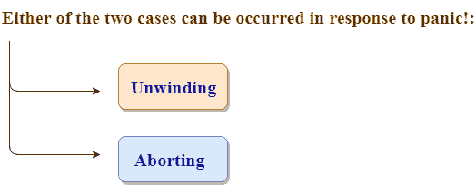
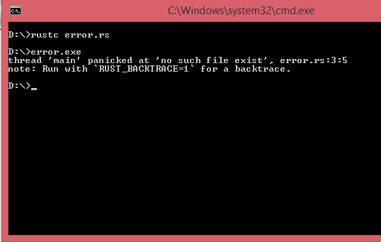
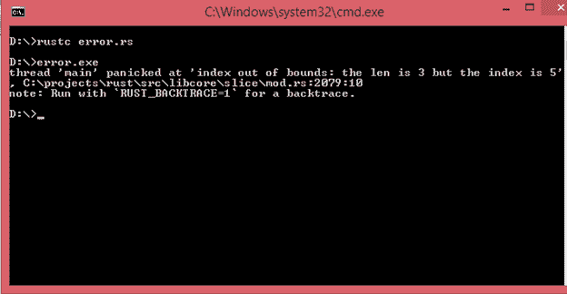

# 慌乱中Rust不可恢复的错误！

> 原文：<https://www.javatpoint.com/rust-unrecoverable-errors>

**不可恢复错误**是检测到的错误，程序员无法处理。当这样的错误发生时，那就慌了！宏被执行。恐慌！打印失败消息。**慌了！**宏解卷清理堆栈后退出。



*   **解绕**:解绕是从遇到的每个函数的栈内存中清理数据的过程。然而，展开的过程需要大量的工作。解套的另一种选择是流产。
*   **中止**:中止是在不清除栈内存数据的情况下结束程序的过程。操作系统将删除数据。如果我们从展开切换到中止，那么我们需要添加以下语句:

```

 panic = 'abort';

```

让我们来看一个恐慌的简单例子！宏:

```

 fn main()
{
    panic!(?No such file exist?);
} 

```

**输出:**



在上面的输出中，第一行显示了传达两个信息的错误消息，即紧急消息和错误位置。紧急消息是“不存在这样的文件”和错误。rs:3:5 表示这是文件错误的第三行第五个字符。rs:3:5 文件。

#### 注意:一般我们不实施恐慌！在我们的项目中。我们的程序代码叫恐慌！在标准库中定义。包含文件名和行号的错误消息在其他人那里可用吗？s 代码哪里慌了！宏被称为。

## 恐慌的好处！巨

Rust 语言没有缓冲区溢出问题。缓冲区溢出是指当从缓冲区读取数据时，程序超出缓冲区，即读取相邻的内存。这导致违反了内存安全。

**我们来看一个简单的例子:**

```

 fn main()
{
   let v = vec![20,30,40];
   print!("element of a vector is :",v[5]);
}

```

**输出:**



在上面的例子中，我们试图访问索引 5 处的第六个元素。在这种情况下，当我们访问无效索引时，Rust 会感到恐慌。因此，Rust 不会归还任何东西。

但是，在其他语言如 C 和 C++ 的情况下，它们会返回一些东西，即使向量不属于那个内存。这就是所谓的缓冲区溢出，它会导致安全问题。

## rust 回溯

Rust Backtrace 是所有被调用来知道是什么导致错误的函数的列表。“我们需要设置 RUST_BACKTRACE 环境变量来获取 BACKTRACE。

* * *