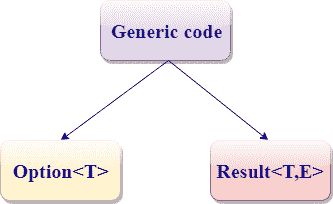
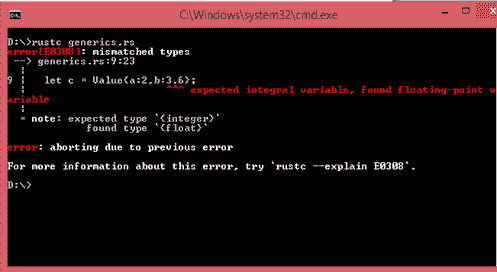
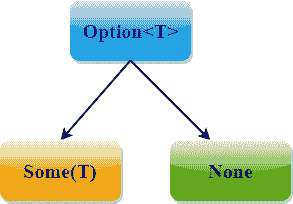

# Rust 泛型

> 原文：<https://www.javatpoint.com/rust-generic>

当我们想要创建多种形式的函数时，即函数的参数可以接受多种类型的数据。这可以通过泛型来实现。泛型也被称为**“参数多态”，其中 poly 是多重的，morph 是形式。**

**提供通用代码有两种方式:**

*   选项
*   结果



**1。选项< T >** : Rust 标准库提供选项<t>，其中“T”是通用数据类型。它提供了一种类型的泛型。</t>

```

 enum Option<T>
{
    Some(T),
    None,
}

```

在上面的例子中，**枚举**是自定义类型，其中< T >是泛型数据类型。我们可以用任何数据类型替换“T”。让我们看看这个:

```

let x : Option<i32> = Some(10);  // 'T' is of type i32.
let x : Option<bool> = Some(true);  // 'T' is of type bool.
let x : Option<f64> = Some(10.5); // 'T' is of type f64.
let x : Option<char> = Some('b'); // 'T' is of type char. 

```

在上述情况下，我们观察到“T”可以是任何类型，即 i32、bool、f64 或 char。但是，如果左侧的类型和右侧的值不匹配，就会出现错误。让我们看看这个:

```

 let x : Option<i32> = Some(10.8); 

```

在上面的例子中，左边的类型是 i32，右边的值是 f64。因此出现错误**“类型不匹配”**。

**2。结果< T，E >** : Rust 标准库提供了另一种数据类型**结果< T，E >，它是通用于两种类型，即 T & E:**

```

   enum Result<T,E>
    {
       OK(T),
         Err(E),
 } 

```

#### 注:这不是一个惯例，我们必须使用“T”和“E”。我们可以使用任何大写字母。

## 通用函数

泛型可以在函数中使用，我们将泛型放在函数的签名中，在签名中指定参数和返回值的数据类型。

*   **当函数包含类型为“T”**的单个参数时。

## 语法:

```

 fn function_name<T>(x:T) 
{
   // body of the function.
}

```

**以上语法有两部分**:

*   <t>:给定的函数是一种类型的泛型。</t>
*   (x : T) : x 为 T 型。

**当函数包含多个相同类型的参数时**。

```

 fn function_name<T>(x:T, y:T) 
{
   // body of the function.
}

```

**当函数包含多种类型的参数时。**

```

 fn function_name<T,U>(x:T, y:U)
{
     // Body of the function.
}

```

```

 fn main()
{
  let a = vec![1,2,3,4,5];
  let b = vec![2.3,3.3,4.3,5.3];
  let result = add(&a);
  let result1 = add(&b);
  println!("The value of result is {}",result);
  println!("The value of result1 is {}",result1);
}

fn add<T>(list:&[T])->T
{
  let mut c =0;
  for &item in list.iter()
  {
    c= c+item;
  }
  c}

```

## 结构定义

结构也可以使用<>运算符在一个或多个字段中使用泛型类型参数。

**语法:**

```

 struct structure_name<T> 
{
   // Body of the structure.
}

```

在上面的语法中，我们在 structure_name 后面的尖括号中声明泛型类型参数，然后我们可以在 struct 定义中使用泛型类型。

**我们来看一个简单的例子**:

```

 struct Value<T>
{
  a:T,
  b:T,
}
fn main()
{
  let integer = Value{a:2,b:3};
  let float = Value{a:7.8,b:12.3};
  println!("integer values : {},{}",integer.a,integer.b);
  println!("Float values :{},{}",float.a,float.b);
}

```

**输出:**

```
integer values : 2,3
Float values : 7.8,12.3

```

在上面的例子中，Value <t>结构在一个类型上是通用的，a 和 b 是相同的类型。我们创建了整数和浮点两个实例。Integer 包含 i32 类型的值，float 包含 f64 类型的值。</t>

**我们再看一个简单的例子。**

```

 struct Value<T>
{
  a:T,
  b:T,
}
fn main()
{
  let c = Value{a:2,b:3.6};
  println!("c values : {},{}",c.a,c.b);
 }

```

**输出:**



在上例中，Value <t>结构在一个类型上是泛型的，a 和 b 是同一类型。我们创建一个“c”的实例。“c”包含不同类型的值，即 i32 和 f64。因此，Rust 编译器抛出“不匹配错误”。</t>

## 枚举定义

枚举也可以使用泛型数据类型。Rust 标准库提供了保存通用数据类型的选项<t>枚举。选项<t>是一个枚举，其中“T”是一个泛型数据类型。</t></t>

*   **选项<T>T1】**

它由两个变体组成，即一些(T)和无。



其中“一些(T)”代表“T”类型的值，“无”不包含任何值。

**我们来看看:**

```

 enum Option<T>
{
    Some(T),
    None,
}

```

在上述情况下，选项<t>是一个枚举，它在一个类型“T”上是通用的。它由两个变体组成:部分(T)和无。</t>

*   **结果< T，E >** :我们可以创建多个类型的泛型。这可以通过结果< T，E >来实现。

```

 enum Result<T,E>
{
    OK(T),
    Err(E),
} 

```

在上述情况下，结果<t e="">是一个在两种类型上通用的枚举，它由两个变量组成，即 OK(T)和 Err(E)。</t>

OK(T)保存“T”类型的值，而 Err(E)保存“E”类型的值。

## 方法定义

我们可以在结构和枚举上实现这些方法。

**我们来看一个简单的例子:**

```

 struct Program<T> {
    a: T,
    b: T,
}
impl<T> Program<T> 
{
    fn a(&self) -> &T 
{
       &self.a
    }
}
fn main() {
let p = Program{ a: 5, b: 10 };

    println!("p.a() is {}", p.a());
}

```

**输出:**

```
p.a() is 5

```

在上面的例子中，我们已经在程序<t>上实现了名为‘a’的方法，该方法返回对变量 a 中存在的数据的引用</t>

我们已经在 impl 后声明了‘T’，以指定我们正在程序<t>上实现该方法。</t>

## 解决歧义

Rust 编译器自动推断泛型参数。让我们通过一个简单的场景来理解这一点:

```

Let mut v = Vec::new();   // creating a vector.
v.push(10); // inserts integer value into the vector. Therefore, v is of i32 type.
println!("{:?}", v); // prints the value of v.

```

在上面的例子中，我们将整数值插入到向量中。因此，Rust 编译器知道向量 v 的类型是 i32。

如果我们删除第二个最后一行，那么它看起来像；

```

Let mut v = Vec::new();   // creating a vector.
println!("{:?}", v); // prints the value of v.

```

上面的情况会抛出一个错误“它无法推断出 T 的类型”。

*   **我们可以通过两种方式解决上述情况:**

1.我们可以使用以下注释:

```

let v : Vec<bool> = Vec::new();
println!("{:?}",v) ;

```

2.我们可以通过使用“涡轮鱼”::<>运算符来绑定泛型参数“T”:

```

let v = Vec :: <bool> :: new();
println!("{:?}",v) ;

```

* * *